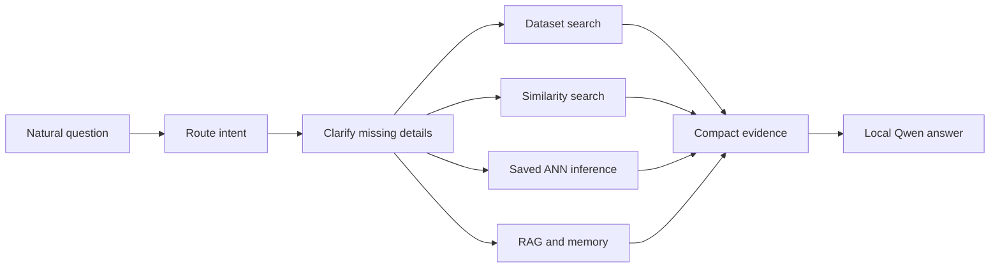

# Diamonds Predictor and Local AI Assistant

This project uses one structured diamond dataset to classify clarity, predict price, discover anonymous purchase profiles, and power a local retrieval-augmented generation (RAG) assistant. The four workflows are connected by a central question: **what information can the available diamond attributes reliably explain?**

## Quick results

| Task | Primary result |
| --- | --- |
| Clarity classification ANN | 83.85% test accuracy; 78.81% Macro F1 |
| Best clarity benchmark | XGBoost: 86.83% test accuracy; 83.66% Macro F1 |
| Price regression ANN | $271.15 test MAE; 0.9798 R² |
| Best price benchmark | XGBoost: $245.44 test MAE; 0.9834 R² |
| Buyer segmentation | K = 3; silhouette = 0.265 |
| Assistant | Structured search + saved models + Chroma RAG + local Qwen |

## Setup

Python 3.11 and Docker Desktop are recommended. Docker provides a reliable TensorFlow runtime if Windows Application Control blocks its native DLL.

```powershell
git clone https://github.com/AliH7861/diamonds-predictor-application.git
cd diamonds-predictor-application
python -m venv .venv
.venv\Scripts\Activate.ps1
python -m pip install --upgrade pip
pip install -r requirements.txt
```

Download the Kaggle Diamonds dataset to `data/raw/diamonds.csv`, then run:

```powershell
python scripts/train_all_models.py --smoke
python scripts/test_saved_models.py
ollama serve
python -m streamlit run app.py
```

The complete developer guide is [docs/TECHNICAL_README.md](docs/TECHNICAL_README.md).

## 1. Dataset and original rows

The source contains 53,940 rows. Each row describes one diamond.

| Original feature | Meaning | Initial decision |
| --- | --- | --- |
| `Unnamed: 0` | Exported row index | Remove; no domain meaning |
| `carat` | Diamond weight | Keep |
| `cut` | Cut quality | Keep |
| `color` | Color grade | Keep |
| `clarity` | Clarity grade | Classification target; regression input |
| `depth` | Total depth percentage | Keep |
| `table` | Top facet width percentage | Keep |
| `price` | Price in US dollars | Regression target; classification experiment input |
| `x`, `y`, `z` | Length, width, and height | Keep after physical validation |

Initial inspection found an exported index, 146 duplicate feature rows, 20 rows with a zero physical dimension, and no missing values in the modeling columns. The dataset has no customer IDs, demographics, or purchase histories. Segmentation therefore represents anonymous purchase profiles rather than tracked customers.

## 2. Cleaning decisions

| Decision | Reason |
| --- | --- |
| Remove the exported index | It describes CSV position, not the diamond |
| Remove non-positive `x`, `y`, or `z` | A physical diamond cannot have a zero dimension |
| Investigate carat-to-volume relationships | Impossible geometry distorts size features |
| Check duplicates and missing values | Repetition or incomplete rows can bias evaluation |
| Preserve plausible unusual diamonds | Legitimate variation should not be removed only because it is rare |

Cleaning preserved physically realistic variation. Each workflow documents its exact row population because classification, regression, and clustering reproduce different maintained experiments.

## 3. Exploratory findings

| Finding | Result |
| --- | ---: |
| Basic valid unique profiles | 53,775 |
| Price range | $326–$18,823 |
| Median / mean price | $2,401 / $3,931.22 |
| Carat range | 0.20–5.01 |
| Median / mean carat | 0.70 / 0.798 |
| Most common cut | Ideal, 21,485 rows |
| Most common color | G, 11,254 rows |
| Most common clarity | SI1, 13,030 rows |

### Clarity

Carat, dimensions, cut, and color contained some clarity signal, but the original grades overlapped heavily. Professional clarity grading depends on microscopic inclusions that this dataset does not contain. Physical measurements could provide hints but could not reproduce grading reliably.

### Price

Price had much stronger structure. Carat had the strongest simple numeric relationship with price (`r = 0.922`), followed by `x` (`0.887`), `z` (`0.868`), and `y` (`0.868`). Depth had almost no simple linear relationship (`-0.011`). Size explained much of price, while cut, color, clarity, proportions, and market thresholds explained differences between similarly sized diamonds.

## 4. Why the rows were engineered

Raw measurements tell the model what was measured. Engineered features express relationships a buyer or grader can interpret.

| Engineered idea | Reason |
| --- | --- |
| Face area and diagonal | Approximate visible size from above |
| Estimated volume | Combine all dimensions into a size proxy |
| Aspect ratio and asymmetry | Describe shape and dimensional balance |
| Depth-to-face and table-to-depth | Describe proportions rather than isolated measurements |
| Weight per face/volume | Show how carat is distributed physically |
| Price per carat/area/volume | Measure value relative to weight and visible size |
| Expected size at a carat weight | Compare whether a diamond faces up larger or smaller than peers |
| Distance from common carat thresholds | Represent buyer-relevant 0.5, 0.75, 1.0, 1.5, and 2.0 ct points |
| Peer rarity and quality-at-size | Add comparable market and buyer context |

### What feature engineering revealed

- Physical-only clarity models plateaued around the low-to-mid 50% range because geometry could not replace microscopic evidence.
- Adding price improved clarity classification dramatically. Market price carried quality information absent from physical measurements.
- Price-relative features improved the representation again by describing price in relation to size.
- Estimated volume and visible size were useful concepts, but several ratios represented almost the same geometry. Extra redundant ratios increased complexity without reliable validation gains.
- Some raw features were weak or misleading alone. Depth barely correlated linearly with price, but proportion and interaction features helped interpret it in context.
- Human-readable regression features could not replace raw geometry. The hybrid representation was strongest.

The central finding was that a feature helped when it introduced a useful relationship. Adding columns alone did not improve a model.

## 5. Clarity classification

### Target

The eight original grades were grouped into five ordered families:

`I1 → I`, `SI1/SI2 → SI`, `VS1/VS2 → VS`, `VVS1/VVS2 → VVS`, `IF → IF`

The dataset lacks the microscopic evidence needed to separate every fine grade consistently. The five-family target better matches the available information.

### Experiments

| Experiment | Question | Feature change | Finding |
| --- | --- | --- | --- |
| 1: Physical | Can geometry, carat, cut, and color predict clarity? | Physical and categorical data | Some signal; heavy overlap |
| 2: Add price | Does known market price contain extra clarity information? | Experiment 1 + price | Large improvement for all models |
| 3: Price context | Are relative value relationships useful beyond raw price? | Experiment 2 + price-per-size features | Strongest representation |

All nine combinations used the same stratified split. Precision, recall, and F1 are macro averages so every clarity family receives equal weight.

| Experiment | Model | Accuracy | Precision | Recall | F1 | Weighted F1 |
| --- | --- | ---: | ---: | ---: | ---: | ---: |
| 1 | XGBoost | 52.13% | 40.70% | 43.40% | 41.52% | 52.42% |
| 1 | ANN | 52.64% | 44.77% | 30.86% | 31.94% | 50.57% |
| 1 | Random Forest | 56.28% | 48.64% | 36.18% | 38.50% | 54.95% |
| 2 | XGBoost | 85.02% | 81.48% | 79.44% | 80.32% | 84.98% |
| 2 | ANN | 83.82% | 82.41% | 75.38% | 78.31% | 83.70% |
| 2 | Random Forest | 81.56% | 83.75% | 66.02% | 71.73% | 81.11% |
| 3 | XGBoost | **86.76%** | 84.16% | **83.00%** | **83.48%** | **86.74%** |
| 3 | ANN | 84.61% | 83.81% | 75.08% | 78.47% | 84.46% |
| 3 | Random Forest | 86.45% | **88.12%** | 77.24% | 81.57% | 86.31% |

### Primary classification model

The assignment model is the Experiment 3 ANN.

| Split | Accuracy | Precision | Recall | F1 | Weighted F1 | Within one family |
| --- | ---: | ---: | ---: | ---: | ---: | ---: |
| Validation | 84.61% | 83.81% | 75.08% | 78.47% | 84.46% | 99.70% |
| Test | **83.85%** | **82.53%** | **76.19%** | **78.81%** | **83.72%** | **99.71%** |

Most errors occurred between neighbouring families. The model is an estimate rather than a replacement for professional grading. Experiment 3 XGBoost remained the strongest benchmark at **86.83% test accuracy and 83.66% Macro F1**.

The clarity use case assumes that listed price is known. The price workflow below answers a different use case where clarity is known. The models do not independently discover both unknown values from the remaining measurements.

## 6. Price regression

Price is the target. The shared split contains 37,729 training, 8,085 validation, and 8,085 test rows.

| Experiment | Question | Representation |
| --- | --- | --- |
| CURRENT_BASELINE | How well do original variables and initial physical features work? | Raw attributes + `REG_` geometry |
| HUMAN_ONLY | Can visible size, quality, thresholds, and peer context replace raw geometry? | Human features without direct x/y/z/depth/table |
| HUMAN_PLUS_RAW | Do both representations complement one another? | Human features + raw geometry |

| Experiment | Model | Inputs | Validation MAE | RMSE | R² | MAPE |
| --- | --- | ---: | ---: | ---: | ---: | ---: |
| CURRENT_BASELINE | XGBoost | 34 | $257.99 | $513.51 | 0.9827 | 6.05% |
| CURRENT_BASELINE | ANN | 34 | $336.90 | $631.47 | 0.9738 | 9.08% |
| CURRENT_BASELINE | Random Forest | 34 | $268.41 | $535.99 | 0.9811 | 6.64% |
| HUMAN_ONLY | XGBoost | 62 | $266.78 | $515.48 | 0.9825 | 7.32% |
| HUMAN_ONLY | ANN | 62 | $290.43 | $575.29 | 0.9782 | 7.79% |
| HUMAN_ONLY | Random Forest | 62 | $272.94 | $528.53 | 0.9816 | 7.92% |
| HUMAN_PLUS_RAW | XGBoost | 67 | **$253.80** | **$506.34** | **0.9831** | **5.99%** |
| HUMAN_PLUS_RAW | ANN | 67 | $279.49 | $552.22 | 0.9799 | 6.99% |
| HUMAN_PLUS_RAW | Random Forest | 67 | $261.69 | $522.61 | 0.9820 | 6.58% |

### Primary regression model

The required course model is the HUMAN_PLUS_RAW ANN.

| Split | MAE | Median AE | RMSE | R² | MAPE | Within 10% |
| --- | ---: | ---: | ---: | ---: | ---: | ---: |
| Validation | $279.49 | $103.44 | $552.22 | 0.9799 | 6.99% | 77.45% |
| Test | **$271.15** | **$97.36** | **$557.31** | **0.9798** | **6.89%** | **77.61%** |

Human features added meaning but lost exact information when used alone. Combining human and raw features produced the strongest representation. XGBoost was the best held-out benchmark at **$245.44 MAE and 0.9834 R²**.

## 7. Buyer segmentation

Each valid diamond is treated as an anonymous purchase profile. Numeric values were standardized because K-Means uses distance; otherwise price values in the thousands would dominate carat near one. Categories were one-hot encoded. Every K used the same 31 inputs and seed.

| K | Silhouette | Inertia | Smallest cluster | Selection score |
| ---: | ---: | ---: | ---: | ---: |
| 3 | **0.265** | 366,385.66 | 14.29% | **0.980** |
| 5 | 0.156 | 322,697.56 | 10.90% | 0.344 |
| 7 | 0.140 | 293,809.94 | 4.67% | 0.172 |
| 10 | 0.135 | 262,776.22 | 0.004% | 0.000 |

K = 3 offered the best separation, balance, and interpretation. K = 10 lowered inertia but produced poorer separation and an almost empty group.

| Cluster | Size | Median price | Median carat | Main cut | Main clarity | Purchase profile | Interpretation |
| ---: | ---: | ---: | ---: | --- | --- | --- | --- |
| 0 | 21,199 | $4,220 | 1.00 | Ideal | SI1 | Mid-range, larger diamonds | Size-focused buyer |
| 1 | 24,892 | $906 | 0.38 | Ideal | VS2 | Affordable, smaller diamonds | Quality-focused buyer |
| 2 | 7,684 | $11,461.50 | 1.54 | Premium | SI2 | Premium-priced, larger diamonds | Luxury-oriented buyer |

The 0.265 silhouette shows useful but moderate separation. These are broad tendencies; real buyers overlap.

## 8. AI diamond assistant

The assistant lets users ask ordinary questions instead of inspecting tables, notebooks, and model files.

| Need | Component |
| --- | --- |
| Exact dataset constraints | Pandas search |
| Similar alternatives | Scaled numeric + encoded categorical distance |
| Price estimate | Saved regression ANN |
| Clarity estimate | Saved classification ANN |
| Project/domain explanation | Embeddings + Chroma RAG |
| Durable preferences | Separate vector memory collection |
| Natural response | Local Qwen through Ollama |



Deterministic tools perform calculations and filtering. Embeddings retrieve semantic knowledge. The LLM explains bounded evidence rather than memorizing 53,000 rows or inventing predictions.

### How Streamlit works

**One-process local mode:**

```text
Browser → Streamlit → local data/models/Chroma/Ollama
```

Run `python -m streamlit run app.py`. Everything stays on the computer.

**Separated frontend and local backend:**

```text
Streamlit → HTTP /chat → local assistant API → data/models/Chroma/Ollama
```

Terminal 1:

```powershell
$env:DIAMOND_ASSISTANT_API_TOKEN="choose-a-long-random-token"
python -m src.assistant.api --port 8770
```

Terminal 2:

```powershell
$env:DIAMOND_ASSISTANT_API_URL="http://127.0.0.1:8770"
$env:DIAMOND_ASSISTANT_API_TOKEN="choose-a-long-random-token"
python -m streamlit run app.py
```

A hosted Streamlit server cannot reach your computer at `127.0.0.1`. To keep the backend local, expose port 8770 through an authenticated HTTPS tunnel and configure the hosted frontend with that URL and the same token. The computer, API, Ollama, and tunnel must remain running. Streamlit Community Cloud can run the Python frontend; Vercel would require a separate supported web frontend.

Normal mode shows chat and recommendations. Developer mode uses the same response but also shows routing, filters, embedding queries, retrieved chunks and scores, model status, memory, and compact evidence.

## 9. Final artifact overview

| Component | Selected approach | Purpose |
| --- | --- | --- |
| Clarity | Experiment 3 ANN | Predict five clarity families |
| Clarity benchmark | Experiment 3 XGBoost | Strongest comparison |
| Price | HUMAN_PLUS_RAW ANN | Required regression model |
| Price benchmark | HUMAN_PLUS_RAW XGBoost | Strongest comparison |
| Segmentation | K-Means, K = 3 | Describe broad purchase profiles |
| Retrieval | Pandas + embeddings/Chroma | Exact matches and explanations |
| Assistant | Router + local Qwen | Combine evidence naturally |

## 10. Main conclusions

1. Useful relationships such as visible size, value per size, and peer context added meaning beyond raw measurements.
2. Redundant ratios did not automatically improve performance.
3. Missing microscopic information limited physical-only clarity prediction.
4. Price was easier to predict because the dataset contained its strongest drivers.
5. Model failure revealed real limits in the data and domain.
6. Human regression features complemented raw measurements but could not replace them.
7. Three broad clusters were more useful than extra, weakly separated groups.
8. Structured data, ML, RAG, and language generation each solved a different assistant problem.

## 11. Limitations

- No microscopic inclusion information.
- No customer IDs, demographics, or repeated purchases.
- Clarity estimation assumes price is known; price estimation assumes clarity is known.
- Purchase profiles overlap and are not fixed buyer personalities.
- K-Means assumes hard, roughly spherical groups.
- Local RAG depends on curated knowledge, embeddings, and a small local LLM.
- Historical Kaggle data may not represent every current market.
- A hosted frontend depends on the local backend and secure tunnel remaining online.

## 12. Possible Improvements

This project answered the main questions I set out to explore, but it also revealed several areas where additional research and experimentation could improve the system.

### Classification

The clarity classification experiments showed that the features available in the Diamonds dataset provide useful information, but they do not contain everything that determines a professional clarity grade. Physical measurements and engineered geometric features provided some signal, but performance improved substantially when price was included.

With more time, I would:

* **Research additional diamond datasets** to see whether other datasets contain features that are more directly related to clarity, such as inclusion characteristics, grading information, or more detailed quality measurements.
* **Research the diamond-grading process further** and identify additional features that could realistically be approximated from structured data.
* **Experiment with more sophisticated classification approaches** rather than stopping with the ANN, Random Forest, and XGBoost models used in this project.
* **Investigate more advanced feature engineering** based specifically on how clarity is determined, rather than creating additional generic mathematical ratios.
* Explore whether the five clarity families could be modeled as an **ordered problem**, since I → SI → VS → VVS → IF represents increasing clarity rather than five completely unrelated categories.
* Investigate whether additional external information could improve the model without relying as heavily on price as a proxy for missing quality information.

The main question for future classification work would be:

> **Can additional domain-specific data or better feature representations recover more of the information that is currently missing from the dataset?**

### Regression

The price regression models performed very well on the current dataset, but they mainly learn the pricing relationships contained within that particular dataset.

Diamond prices in the real market can also be affected by factors that are not represented here.

With more time, I would:

* **Research the diamond industry and pricing process more deeply** to understand what additional factors influence real market prices.
* Add **market trends and time-based information**, since diamond prices may change across different years and market conditions.
* Investigate factors such as current demand, supply, certification, retailer differences, natural versus lab-grown diamonds, and other market conditions where suitable data is available.
* Test the model on **external diamond datasets** to determine whether the relationships learned from this dataset generalize to other markets.
* Continue experimenting with combinations of raw and engineered features to determine whether the same accuracy can be achieved with a smaller and simpler feature set.

The next regression question would therefore move beyond:

> **“Can I predict the price in this dataset?”**

toward:

> **“Can I predict a realistic diamond market price when market conditions and external pricing factors are also considered?”**

### Clustering and Buyer Segmentation

K-Means with **K = 3** produced the most useful segmentation among the values tested, but the silhouette score of **0.265** also showed that the clusters still overlap considerably.

One limitation of the current work is that I mainly investigated different values of **K within K-Means**. I did not extensively test whether K-Means itself was the best clustering method for this dataset.

With more time, I would:

* **Compare alternative clustering algorithms** instead of assuming K-Means is the best approach.
* Investigate methods that can represent overlapping or less regularly shaped groups, rather than requiring every purchase to belong rigidly to one K-Means cluster.
* Compare whether alternative methods produce clusters with **better separation and more meaningful business interpretations**.
* Investigate whether the current feature combination causes some dimensions, such as price or diamond size, to influence the segments more strongly than intended.
* Experiment with clustering **different groups of features separately**, such as value-related features, quality-related features, and physical-size features.
* Study the three current clusters in greater detail to understand **why certain purchase profiles sit between multiple clusters**.
* Investigate whether the moderate silhouette score reflects a limitation of K-Means or whether diamond purchasing behaviour genuinely exists on a continuous spectrum without sharply separated groups.

The most important future clustering question would be:

> **Are three overlapping groups genuinely the natural structure of the data, or could a different clustering approach reveal a stronger and more useful segmentation?**

### AI Assistant and RAG

The current assistant uses a hybrid approach because different questions are better handled by different components: structured dataset filtering, machine-learning models, vector retrieval, and the language model.

The architecture works, but it was designed primarily to make the complete system functional. It was **not heavily optimized for token efficiency, retrieval efficiency, or advanced orchestration**.

With more time, I would focus heavily on this area.

I would:

* Improve **query rewriting**, so a user's original question can be converted into a shorter and more precise search or retrieval query before reaching the vector database.
* Investigate ways to **accomplish the same task with significantly less prompt context**, rather than repeatedly sending unnecessary information to the language model.
* Store and reuse compact structured information from previous turns instead of repeatedly including large portions of conversation history.
* Improve retrieval so that only the **smallest amount of relevant evidence** needed to answer the question is placed into the final prompt.
* Experiment with better chunking and retrieval strategies to reduce irrelevant RAG context.
* Measure **token usage, retrieval size, response quality, and latency** instead of evaluating the assistant mainly by whether it produces a correct response.
* Research more sophisticated **routing and orchestration designs** for systems that combine structured data, RAG, ML models, and conversational state.
* Investigate frameworks such as **LangChain or LangGraph** to determine whether they could simplify routing, multi-step workflows, tool use, and conversation-state management.
* Compare those frameworks against the current custom implementation rather than assuming that using an orchestration framework automatically produces a better system.
* Develop a more formal assistant evaluation set containing different types of questions, such as filtering, price prediction, clarity prediction, explanations, recommendations, and multi-turn questions.

The longer-term goal would be to make the assistant **more efficient rather than simply larger**:

> **Retrieve less, send less, reuse useful context, and still produce the same or better answer.**

### Overall Future Direction

The next version of the project would focus less on simply adding more models and more features and more on investigating the limitations discovered during this version.

The main questions I would explore are:

* **Classification:** Can better domain data and more sophisticated features reduce the information gap in clarity prediction?
* **Regression:** Can market and industry information make price prediction representative of the real diamond market rather than only this dataset?
* **Clustering:** Is K-Means actually the best representation of purchase behaviour, or can another method find stronger and more interpretable groups?
* **Assistant:** Can the same hybrid system answer complex questions using substantially less retrieved context and fewer tokens?

These improvements follow directly from the findings and limitations discovered during the project rather than simply adding additional technology for its own sake.

## Technical documentation

Repository structure, file responsibilities, training, APIs, tests, Docker, CI/CD, artifacts, and troubleshooting are documented in [docs/TECHNICAL_README.md](docs/TECHNICAL_README.md).

## Repository

[github.com/AliH7861/diamonds-predictor-application](https://github.com/AliH7861/diamonds-predictor-application)
