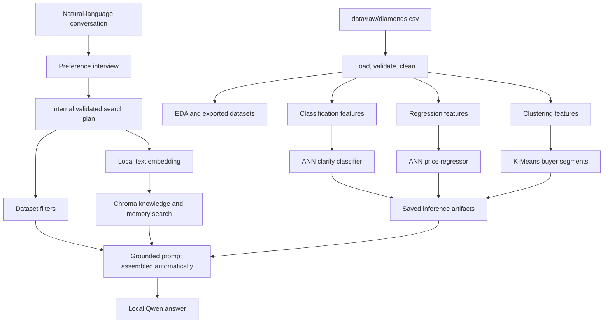
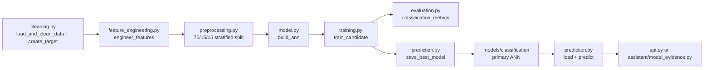
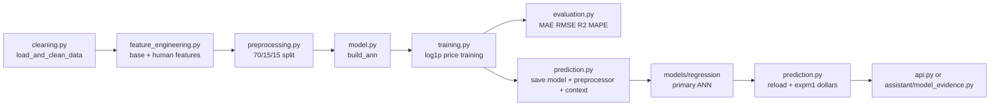
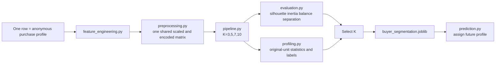
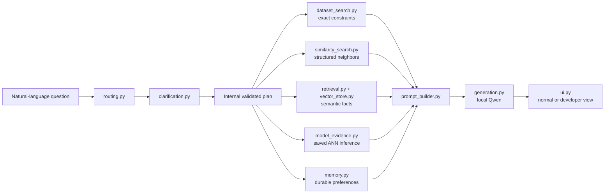

# Diamonds Predictor and Local AI Assistant

This project analyzes one diamond dataset through four complete workflows:

1. An artificial neural network (ANN) classifies diamond clarity.
2. An ANN predicts diamond price.
3. K-Means groups diamond purchase profiles into likely buyer segments.
4. A local retrieval-augmented generation (RAG) assistant answers natural-language questions using dataset rows, curated diamond knowledge, saved model estimates, and remembered preferences.

The two ANNs are the primary supervised models because the project brief explicitly requires ANN classification and regression. XGBoost and Random Forest are trained as comparisons. The strongest benchmark is saved separately from the primary ANN.

## Project walkthrough

Read or present the project in this order:

1. [Setup](#setup) explains installation, the dataset location, and the commands used to verify the repository.
2. [Data and EDA findings](#data-and-eda-findings) documents cleaning, statistics, distributions, and relationships.
3. [Classification findings](#classification-findings) explains the feature experiments, primary clarity ANN, and comparison models.
4. [Regression findings](#regression-findings) explains the price target, feature representations, primary price ANN, and comparison models.
5. [Customer and buyer segmentation findings](#customer-and-buyer-segmentation-findings) compares K = 3, 5, 7, and 10 and interprets the selected clusters.
6. [How the RAG assistant works](#how-the-rag-assistant-works) covers natural-language questioning, embeddings, retrieval, saved-model evidence, and memory.
7. [Automated tests and CI/CD](#automated-tests-and-cicd) shows how every component is checked locally and on GitHub Actions.
8. [Limitations and possible improvements](#limitations-and-possible-improvements) records the next technical improvements.

## Project status

| Requirement | Coverage | Evidence |
| --- | --- | --- |
| Data collection and inspection | Complete | Raw loader, schema checks, notebook DataFrames and statistics |
| EDA and visualizations | Complete | EDA notebook, `sideEDA/`, generated tables and figures |
| Cleaning and feature engineering | Complete | Reusable modules under `src/` |
| ANN clarity classification | Complete | Three feature experiments, validation/test metrics, saved ANN |
| ANN price regression | Complete | Three feature experiments, validation/test metrics, saved ANN |
| Buyer segmentation | Complete | K = 3, 5, 7, 10 comparison, cluster profiles, saved K-Means pipeline |
| Local AI assistant | Complete | Interview, embeddings, Chroma retrieval, dataset search, memory, grounded response |
| Automated testing and CI | Complete locally | Unit, integration, RAG, clustering, end-to-end, lint, and Docker jobs; GitHub status begins after the first push |
| GitHub submission | In progress | The local repository is ready; the public GitHub repository and Actions run are created during submission |

## End-to-end architecture



Training and inference are separate. Training creates fitted preprocessing and model files. Inference reloads those files and predicts without training again.

## Repository structure

```text
app.py                         Streamlit assistant entry point
data/                          Raw and reproducible processed datasets
knowledge/                     Trusted Markdown used by RAG
models/
  classification/             Primary classification ANN
    benchmark_winner/          Strongest classification benchmark
  regression/                 Primary regression ANN
    benchmark_winner/          Strongest regression benchmark
  clustering/                  Saved preprocessing and K-Means pipeline
notebooks/
  01_old_eda.ipynb             Maintained exploratory analysis
  02_classification.ipynb      Clarity experiments and visual results
  03_regression.ipynb          Price experiments and visual results
  04_buyer_segmentation.ipynb  K comparison and buyer profiles
outputs/                       Generated metrics, tables, figures, reports
scripts/                       Terminal training, tracing, and validation commands
sideEDA/                       Historical notebooks and recovered EDA evidence
src/                           Assistant, classification, regression, clustering
tests/                         Unit, integration, and end-to-end tests
.github/workflows/             GitHub Actions CI definition
```

The notebooks contain explanations, experiment calls, DataFrame displays, statistics, and plots. Reusable operations live in Python modules so notebooks do not duplicate preprocessing and feature logic.

## Workflow diagrams

### ANN clarity classification



### ANN price regression



### Buyer segmentation



### Local RAG assistant



## File-by-file architecture map

| File | Responsibility | Called By | Calls | Input | Output | Artifacts |
| --- | --- | --- | --- | --- | --- | --- |
| `app.py` | Streamlit entry point | Terminal | `assistant.runtime`, `assistant.ui` | App launch | Running UI | None |
| `src/classification/cleaning.py` | Validate rows, clean geometry, create clarity-family target | Classification preprocessing | Pandas | Raw CSV | Clean labeled DataFrame | None |
| `src/classification/feature_engineering.py` | Create physical and price-relative features and experiment lists | Classification preprocessing and prediction | NumPy/Pandas | Clean rows | Engineered rows | None |
| `src/classification/preprocessing.py` | Stratified split; fit imputer, scaler, encoder on training rows | Notebook, training scripts, tests | Cleaning, feature engineering, sklearn | CSV | Three prepared experiments | Processed exports through `datasets.py` |
| `src/classification/model.py` | Define course and tuned ANN architectures | Classification training | TensorFlow/Keras | Encoded input width | Untrained ANN | None |
| `src/classification/training.py` | Train ANN, XGBoost, Random Forest; validate; smoke train; final test | Notebook and training scripts | Model, evaluation | Prepared matrices | Trained run and metrics | None directly |
| `src/classification/evaluation.py` | Accuracy, precision, recall, F1, balanced and ordinal-error metrics | Training and verification | sklearn metrics | Actual/predicted classes | Metric dictionary | Metrics JSON/CSV through caller |
| `src/classification/diagnostics.py` | Distributions, correlations, top-eight importance and relationships | Classification notebook | Training predictions, matplotlib | Prepared data and models | Figures/rankings | `outputs/classification/figures/` |
| `src/classification/datasets.py` | Display/export DataFrames and statistics | Classification notebook | Prepared experiment data | Prepared data | CSVs, summaries, manifest | `data/processed/classification/` |
| `src/classification/prediction.py` | Save/load fitted model and preprocessor; validate raw inputs; infer clarity | Training, API, assistant, verification | Feature engineering, Joblib/Keras | Raw diamond fields | Clarity family/probabilities | `models/classification/` |
| `src/classification/api.py` | Serve clarity inference over HTTP | Terminal | Classification prediction | JSON request | JSON response | Reads classification model |
| `src/regression/config.py` | Paths, seed, tuned tree parameters | Regression modules | Project config | Environment/repository | Constants | None |
| `src/regression/cleaning.py` | Reproduce historical valid regression population | Regression preprocessing | Pandas | Raw CSV | Raw, clean, removed rows | None |
| `src/regression/feature_engineering.py` | Create base geometry and training-derived human valuation features | Preprocessing and prediction | NumPy/Pandas | Clean rows/training context | Three feature representations | Learned context saved in model bundle |
| `src/regression/preprocessing.py` | Split once; fit human context and encoders on training rows | Notebook, scripts, tests | Cleaning, feature engineering, sklearn | CSV | Frames, matrices, targets | Processed exports through `datasets.py` |
| `src/regression/model.py` | Define price ANN | Regression training | TensorFlow/Keras | Encoded input width | Untrained ANN | None |
| `src/regression/training.py` | Train comparisons on `log1p(price)`, validate, select, inverse-transform, test | Notebook and scripts | Model, evaluation | Prepared experiments | Trained run/predictions/metrics | None directly |
| `src/regression/evaluation.py` | Dollar, percentage, bias, percentile, severity, and price-band metrics | Training and notebook | sklearn metrics | Actual/predicted prices | Metrics and band reports | Metrics through caller |
| `src/regression/visualizations.py` | EDA, comparisons, top features, predictions, and errors | Regression notebook | Training inference, matplotlib | Data/models/results | Figures | `outputs/regression/figures/` |
| `src/regression/datasets.py` | Display/export original and encoded data with statistics | Regression notebook | Prepared data | Frames/matrices | CSVs and summaries | `data/processed/regression/` |
| `src/regression/prediction.py` | Save/load ANN or tree bundle and convert predictions with `expm1` | Training, API, assistant, verification | Feature engineering, training prediction | Nine raw fields | Dollar estimate | `models/regression/` |
| `src/regression/api.py` | Serve price inference over HTTP | Terminal | Regression prediction | JSON request | JSON response | Reads regression model |
| `src/clustering/feature_engineering.py` | Create purchase-profile geometry and value features | Clustering preprocessing | NumPy/Pandas | Valid rows | Engineered profiles | None |
| `src/clustering/preprocessing.py` | Remove invalid/duplicate rows; fit scaling and encoding once | Clustering pipeline | Feature engineering, sklearn | Raw CSV | Original profiles and shared matrix | Preprocessor passed to persistence |
| `src/clustering/evaluation.py` | Calculate silhouette, inertia, sizes, balance, centroid distance, score | Clustering pipeline | sklearn/NumPy | Model, matrix, labels | K metrics | K comparison CSV through caller |
| `src/clustering/profiling.py` | Calculate numeric and categorical profiles in original units and infer buyer labels | Clustering pipeline | Pandas | Original rows and labels | Summary/statistics/distributions | Profile CSVs through caller |
| `src/clustering/visualizations.py` | Plot K comparison, cluster sizes, and PCA view | Clustering pipeline | matplotlib/sklearn | Metrics/matrix/labels | Figures | `outputs/clustering/figures/` |
| `src/clustering/pipeline.py` | Fit K=3,5,7,10 on one matrix, select K, export and persist | Notebook, CLI, tests | All clustering stages | Raw CSV | Selected result | Tables, figures, `buyer_segmentation.joblib` |
| `src/clustering/prediction.py` | Reload selected K-Means pipeline and assign a future profile | Tests/future application | Feature engineering, Joblib | Raw purchase profile | Cluster and buyer label | Reads clustering model |
| `src/assistant/config.py` | Assistant paths, model names, and evidence limits | Assistant runtime | Environment | Environment variables | Settings | None |
| `src/assistant/schemas.py` | Validate route and LLM/application plan objects | Routing, clarification, service | Dataclasses | Internal dictionaries | Typed plans | None |
| `src/assistant/routing.py` | Detect intent and choose only required evidence sources | Assistant service | Schemas | Question and recent text | Evidence route | None |
| `src/assistant/clarification.py` | Parse buying constraints and raw ANN inputs; ask for missing values | Assistant service | Regex, schemas | Natural-language conversation | Complete plan or clarification | None |
| `src/assistant/dataset_search.py` | Apply exact Pandas filters and deterministic ranking | Assistant service | Pandas | Plan and catalog | Matching rows | Reads raw dataset through runtime |
| `src/assistant/similarity_search.py` | Fit reusable scaled/encoded feature space and rank similar rows | Runtime and service | sklearn | Catalog, reference, constraints | Similar diamonds and scores | In-memory fitted preprocessor |
| `src/assistant/vector_store.py` | Index/search separate knowledge and preference collections | Runtime, retrieval, memory | Chroma, embedder | Facts/preferences/query vectors | Scored chunks | `vector_db/chroma_v2/` |
| `src/assistant/retrieval.py` | Run compact semantic search and optional second retrieval | Assistant service | Vector store, LLM check | Question/queries | Up to six deduplicated chunks | Reads knowledge collection |
| `src/assistant/model_evidence.py` | Load primary ANNs once and run routed inference without fitting | Runtime and service | Classification/regression prediction | Raw input or matched rows | ANN estimates/enriched rows | Reads primary model bundles |
| `src/assistant/memory.py` | Retrieve and save explicit durable preferences | Assistant service | Vector store, structured LLM decision | Question/preference text | Recalled/saved memory | Preference collection |
| `src/assistant/prompt_builder.py` | Limit rows, columns, facts, memory, and history; build internal payload | Assistant service | Schemas/Pandas/JSON | Routed evidence | Compact prompt | None |
| `src/assistant/generation.py` | Call local Qwen for structured planning and final text; create embeddings | Runtime, retrieval, service, vector store | Ollama HTTP API | System/user text | JSON, answer, vectors | Ollama model cache |
| `src/assistant/service.py` | Main visible orchestrator for every assistant stage | UI, terminal tests | All assistant stages | Natural-language question/history | Shared result object | None directly |
| `src/assistant/runtime.py` | Construct and cache-ready wire the production assistant once | `app.py`, trace/live tests | Config, catalog, Ollama, Chroma, similarity, models, service | Local project/environment | Assistant instance | Reads data, knowledge, models; creates vector DB |
| `src/assistant/ui.py` | Render normal and developer modes from the same backend result | `app.py` | Assistant service | Session conversation | Streamlit page | Session state |
| `src/assistant/ui_content.py` | Store editable user-facing title and descriptions | UI | None | Source constants | UI copy | None |
| `scripts/train_all_models.py` | Train all maintained supervised experiments and clustering | Terminal | All ML training pipelines | Raw CSV | Models and metrics | `models/`, `outputs/` |
| `scripts/test_saved_models.py` | Reload primary ANNs and benchmarks and make sample predictions | Terminal | Prediction modules | Saved artifacts | PASS/failure and predictions | Reads `models/` |
| `scripts/verify_final_metrics.py` | Recalculate held-out metrics from saved full models without training | Terminal | Preprocessing, prediction, evaluation | Raw CSV and saved models | Final metric reports | `outputs/final_model_test_metrics.json` |
| `scripts/run_clustering.py` | Run full or smoke buyer segmentation, using Docker on Windows | Terminal/CI | Clustering pipeline | Raw or generated test CSV | Clusters and artifact | Clustering outputs/model |
| `scripts/test_rag.py` | Test clarification, embedding, Chroma, filtering, grounding, and memory | Terminal/CI | Assistant service/runtime | Test or live question set | PASS/failure | Temporary CI Chroma or live vector DB |
| `scripts/trace_rag.py` | Print every routed assistant stage and compact prompt evidence | Terminal | Assistant runtime/service | Natural-language turns | Developer trace | Reads production evidence |
| `scripts/phase1_end_to_end.py` | Fast ANN preprocessing, fit, metric, save, reload rehearsal | Terminal/CI/Docker | Supervised modules | Generated diamonds | Ten PASS/failure stages | Temporary models |

Package `__init__.py` files expose stable public imports and contain no workflow logic.

## Artifact map

| Artifact | Written by | Read by | Meaning |
| --- | --- | --- | --- |
| `data/processed/classification/` | `classification/datasets.py` | Notebook/review | Clean, engineered, split, encoded clarity datasets and statistics |
| `data/processed/regression/` | `regression/datasets.py` | Notebook/review | Base, human, hybrid, split, encoded price datasets and statistics |
| `models/classification/` | `classification/prediction.py` | API, assistant, saved-model test | Primary assignment ANN and fitted preprocessor |
| `models/classification/benchmark_winner/` | Training script | Saved-model test | Strongest classification comparison |
| `models/regression/` | `regression/prediction.py` | API, assistant, saved-model test | Primary assignment ANN, preprocessor, and human-feature context |
| `models/regression/benchmark_winner/` | Training script | Saved-model test | Strongest price comparison |
| `models/clustering/buyer_segmentation.joblib` | `clustering/pipeline.py` | `clustering/prediction.py` | Selected K, preprocessing, K-Means model, segment labels |
| `outputs/*` | Notebooks and scripts | README/review | Metrics, tables, figures, and reports |
| `vector_db/chroma_v2/` | `assistant/vector_store.py` | RAG retrieval and memory | Separate domain-knowledge and preference vector collections |

## Setup

Python 3.11 and Docker Desktop are recommended. Docker avoids the Windows Application Control error that can block TensorFlow's native DLL.

```powershell
python -m venv .venv
.venv\Scripts\Activate.ps1
python -m pip install --upgrade pip
pip install -r requirements.txt
python -m ipykernel install --user --name diamond-ml --display-name "Diamond ML (.venv)"
```

Place the dataset at `data/raw/diamonds.csv`. Generated test data lets CI run without publishing the private dataset.

## Fastest way to prove the project works

Run these commands from the repository root:

```powershell
# Rehearse every maintained model path with small models and separate artifacts.
python scripts/train_all_models.py --smoke

# Reload saved classifiers and regressors and predict without fitting.
python scripts/test_saved_models.py

# Recalculate held-out test metrics from every saved full model without training.
python scripts/verify_final_metrics.py

# Test the complete deterministic RAG path used by CI.
python scripts/test_rag.py --ci

# Test K = 3, 5, 7, and 10, profiling, export, save, and reload.
python scripts/run_clustering.py --smoke

# Start the user interface.
python -m streamlit run app.py
```

The smoke command proves the structure works; its scores are intentionally not final results. `test_saved_models.py` uses the full saved artifacts when present and automatically uses Docker for compatible TensorFlow loading.

## Full training process

```powershell
python scripts/train_all_models.py
```

This command loads and cleans data, creates a consistent split, runs three feature experiments for each supervised task, and trains XGBoost, ANN, and Random Forest for every experiment. It prints progress and validation metrics, saves the strongest ANN for each course task, saves the strongest overall comparison under `benchmark_winner/`, and completes the K-Means comparison and profiling.

Full training can take time. It does not require rerunning notebooks. The notebooks call the same modules to display and explain the experiments.

## Notebook process

Start Jupyter and use **Restart Kernel and Run All** in this order:

```powershell
jupyter notebook
```

1. `notebooks/01_old_eda.ipynb`
2. `notebooks/02_classification.ipynb`
3. `notebooks/03_regression.ipynb`
4. `notebooks/04_buyer_segmentation.ipynb`

## Data and EDA findings

The source contains 53,940 rows and ten diamond attributes plus the exported CSV index column. The modeling attributes contain no missing values. After dropping the index column, the data contains 146 duplicate feature rows and 20 rows with a zero physical dimension; one row belongs to both groups.

| Finding | Result |
| --- | ---: |
| Basic cleaned purchase profiles | 53,775 |
| Price range | $326-$18,823 |
| Median / mean price | $2,401 / $3,931.22 |
| Carat range | 0.20-5.01 |
| Median / mean carat | 0.70 / 0.798 |
| Most common cut | Ideal (21,485 rows) |
| Most common color | G (11,254 rows) |
| Most common original clarity | SI1 (13,030 rows) |

Carat has the strongest simple numeric relationship with price (`r = 0.922`), followed by `x` (`0.887`), `z` (`0.868`), and `y` (`0.868`). Table has a weaker positive correlation (`0.127`), while depth has almost no linear price correlation (`-0.011`). The notebooks contain the distributions, correlation plots, and more detailed relationship views.

Cleaning is task-specific and documented in code. Classification applies a wide physical carat-to-volume outlier rule after removing duplicates, leaving 53,572 rows and a stratified 37,500 / 8,036 / 8,036 split. Regression preserves duplicates to reproduce the historical experiment population and applies a carat-band volume rule, leaving 53,899 rows and the recorded 37,729 / 8,085 / 8,085 split. Clustering uses the basic 53,775 valid unique purchase profiles.

## Classification findings

The target is the five-level clarity family: `I`, `SI`, `VS`, `VVS`, or `IF`. Experiment 3 includes raw geometry, engineered geometry, price-derived features, cut, and color.

### Primary classification ANN

| Split | Accuracy | Macro precision | Macro recall | Macro F1 | Weighted F1 | Within one family |
| --- | ---: | ---: | ---: | ---: | ---: | ---: |
| Validation | 84.61% | 83.81% | 75.08% | 78.47% | 84.46% | 99.70% |
| Test | 83.85% | 82.53% | 76.19% | 78.81% | 83.72% | 99.71% |

The primary ANN satisfies the course requirement and exceeds 80% test accuracy, precision, and weighted F1. Macro recall and macro F1 are lower because rare clarity families are harder to classify.

### Classification comparison

| Experiment 3 model | Validation accuracy | Validation macro F1 |
| --- | ---: | ---: |
| XGBoost benchmark | 86.76% | 83.48% |
| ANN primary | 84.61% | 78.47% |
| Random Forest | 86.45% | 81.57% |

XGBoost is the strongest comparison model. The ANN remains the reported course model, while the comparison shows that tree ensembles suit this structured dataset well.

The saved XGBoost benchmark was independently reloaded and evaluated on the held-out test split: **86.83% accuracy, 83.66% macro F1, and 86.81% weighted F1**.

## Regression findings

The target is `price`; clarity is an input. The shared split contains 37,729 training, 8,085 validation, and 8,085 test rows.

| Feature experiment | Meaning | XGBoost validation MAE |
| --- | --- | ---: |
| CURRENT_BASELINE | Raw variables plus initial engineered features | $257.99 |
| HUMAN_ONLY | Human-readable valuation features without raw geometry | $266.78 |
| HUMAN_PLUS_RAW | Human-readable features combined with raw geometry | $253.80 |

The hybrid representation performs best. Human-readable features add information, but they do not replace the raw measurements.

### Primary regression ANN

| Split | MAE | Median absolute error | RMSE | R² | MAPE | Within 10% |
| --- | ---: | ---: | ---: | ---: | ---: | ---: |
| Validation | $279.49 | $103.44 | $552.22 | 0.9799 | 6.99% | 77.45% |
| Test | $271.15 | $97.36 | $557.31 | 0.9798 | 6.89% | 77.61% |

On the test set, 90.82% of ANN predictions are within 15%, 95.75% are within 20%, and 1.34% miss by more than 30%.

### Regression comparison

| HUMAN_PLUS_RAW model | Validation MAE | Validation RMSE | Validation R² | Within 10% |
| --- | ---: | ---: | ---: | ---: |
| XGBoost benchmark | $253.80 | $506.34 | 0.9831 | 82.00% |
| ANN primary | $279.49 | $552.22 | 0.9799 | 77.45% |
| Random Forest | $261.69 | $522.61 | 0.9820 | 78.45% |

XGBoost is the strongest regression benchmark. The primary ANN still explains about 98% of test price variation and fulfills the regression ANN requirement.

The saved XGBoost benchmark was independently reloaded and evaluated on the held-out test split: **$245.44 MAE, $505.07 RMSE, 0.9834 R², 5.89% MAPE, and 82.46% of predictions within 10%**.

## Customer and buyer segmentation findings

The dataset has no customer IDs. Each valid diamond row is treated as an anonymous purchase profile. Numeric attributes are scaled, and cut, color, and clarity are one-hot encoded. Every K experiment uses the same 31 encoded inputs and random seed.

### K comparison on 53,775 purchase profiles

| K | Silhouette | Inertia | Smallest cluster | Selection score |
| ---: | ---: | ---: | ---: | ---: |
| 3 | 0.265 | 366,385.66 | 14.29% | 0.980 |
| 5 | 0.156 | 322,697.56 | 10.90% | 0.344 |
| 7 | 0.140 | 293,809.94 | 4.67% | 0.172 |
| 10 | 0.135 | 262,776.22 | 0.004% | 0.000 |

K = 3 is selected using silhouette separation, centroid distance, cluster balance, minimum size, and simplicity. This avoids choosing from inertia alone.

### Selected buyer profiles

| Cluster | Size | Median price | Price range | Median carat | Main cut | Main clarity | Purchase profile | Buyer interpretation |
| ---: | ---: | ---: | ---: | ---: | --- | --- | --- | --- |
| 0 | 21,199 | $4,220 | $816-$10,760 | 1.00 | Ideal | SI1 | Mid-range, larger diamonds | Size-focused buyer |
| 1 | 24,892 | $906 | $326-$4,042 | 0.38 | Ideal | VS2 | Affordable, smaller diamonds | Quality-focused buyer |
| 2 | 7,684 | $11,461.50 | $1,970-$18,823 | 1.54 | Premium | SI2 | Premium-priced, larger diamonds | Luxury-oriented buyer |

These labels describe likely buyer behavior inferred from diamond characteristics. They are not observed customer identities.

## How the RAG assistant works

The user communicates entirely in natural language. The application creates and validates an internal structured plan so dataset filters are reliable; the user never has to write JSON. The UI can display that plan in the retrieval trace for transparency.

For “I want a diamond around $6,000 and clarity matters most,” the assistant:

1. Reads the question and earlier conversation turns.
2. Checks whether budget, size, and quality priorities are concrete enough.
3. Asks normal-language follow-ups for missing carat and acceptable clarity. No embedding search runs while required details are missing.
4. Converts the completed conversation into validated filters and knowledge queries internally.
5. Uses `nomic-embed-text` to create query vectors.
6. Uses Chroma to return similar knowledge and preference memories with sources and similarity scores.
7. Uses Pandas to find dataset rows and available saved ANN models to enrich results.
8. Automatically builds the final prompt from the conversation, matches, model evidence, retrieved knowledge, and memory. Local Qwen writes the grounded response.
9. Embeds explicit durable preferences into a separate memory collection for later turns.

This is a three-source grounding system: structured dataset matches, semantic RAG context, and saved model evidence. The interview happens before retrieval when the request is incomplete.

### Evidence routing

| User intent | Exact Pandas filters | Structured similarity | Chroma knowledge | Primary ANN | Preference memory |
| --- | ---: | ---: | ---: | ---: | ---: |
| “What does VS2 mean?” |  |  | Yes |  | Yes |
| “Find a 1ct Ideal diamond under $6,000” | Yes |  | Yes | Yes | Yes |
| “Find something similar but cheaper” | Yes | Yes | Yes | Yes | Yes |
| “What would this diamond cost?” |  |  | Yes | Regression ANN | Yes |
| “Predict this diamond's clarity family” |  |  | Yes | Classification ANN | Yes |
| “Why is this diamond expensive?” | When constraints exist |  | Yes | When a full row exists | Yes |

Exact constraints never require vector search over all 53,000 rows. `dataset_search.py` uses Pandas for price, carat, cut, color, clarity, depth, table, and dimensions represented in the catalog. `similarity_search.py` fits one numeric-scaling and categorical-encoding space at startup, then ranks comparable structured rows. `retrieval.py` uses text embeddings only for domain facts. `model_evidence.py` loads the primary saved ANNs once and performs inference only.

### Normal and developer UI modes

Both modes call the same `DiamondAssistant.ask()` backend and receive the same result object.

| Mode | Visible information |
| --- | --- |
| Normal | Natural-language conversation, clarification questions, final explanation, and recommended dataset examples |
| Developer | Everything in Normal mode plus intent, internal plan, filters, exact matches, similarity scores, RAG queries, retrieved chunks, ANN status/evidence, memory, compact Qwen payload, and ordered stages |

Use the **Developer mode** toggle at the top of the Streamlit page. Internal JSON is an implementation contract between stages; users type only natural language.

### Token and context efficiency

- The router skips evidence sources that the current intent does not need.
- Clarification completes missing requirements before embeddings or model calls.
- Exact filters and structured similarity run locally without sending the dataset to Qwen.
- Only five top rows and useful columns enter the compact evidence payload.
- At most six retrieved chunks are retained, and each fact is capped at 500 characters.
- Preference recall is limited to four items.
- Conversation context is limited to eight recent turns and 4,000 characters.
- Saved ANNs and the similarity preprocessor load once at application startup and never retrain during chat.

### Run the assistant

```powershell
pip install -r requirements-assistant.txt
ollama pull qwen3.5:4b
ollama pull nomic-embed-text
ollama serve
python -m streamlit run app.py
```

The model and vector index are cached when the Streamlit application opens, which makes later questions faster. Edit the title, description, placeholder, and starter questions in `src/assistant/ui_content.py`.

### See the retrieval process in the terminal

```powershell
python scripts/trace_rag.py
```

The trace prints the interview decision, internal plan, embedding queries, retrieved sources, similarity scores, dataset filters and matches, recalled memory, pipeline stages, and final answer. It exposes evidence and routing decisions rather than private model chain-of-thought.

### Test RAG

```powershell
# Repeatable CI version: deterministic local vectors/LLM plus real Chroma.
python scripts/test_rag.py --ci

# Live version: real Ollama embeddings and Qwen generation.
python scripts/test_rag.py
```

The CI scenario uses a multi-turn natural-language buying conversation. It verifies that an incomplete $6,000 clarity-focused request triggers follow-up questions before embedding, retrieval starts only after carat, clarity, and cut become concrete, filters are honored, scored context reaches the final prompt, and saved preferences are recalled later.

The repeatable CI test intentionally does not download or evaluate Qwen. The live test covers the installed local Ollama models.

## Leakage and correctness audit

| Workflow | Risk | File/function | Safe/Unsafe | Explanation |
| --- | --- | --- | --- | --- |
| Classification | Scaling or encoding before splitting | `classification/preprocessing.py::prepare_classification_data` | Safe | Rows split first; each experiment fits its preprocessor on training rows and transforms validation/test rows. |
| Classification | Target leakage from clarity | `classification/feature_engineering.py` | Safe | Original clarity is removed from model inputs; only `Clarity_Target` is the label. |
| Classification | Price-derived features act as a strong proxy | Experiment 2/3 feature lists | Safe for defined scope | Price is an intentionally available input for classifying a known diamond. The API therefore requires price. It would be unsuitable if clarity had to be predicted before price was known. |
| Classification | Outlier thresholds see the full feature population | `classification/cleaning.py::load_and_clean_data` | Safe with caveat | The wide IQR rule does not use clarity labels, but strict evaluation could fit this threshold on training rows only. |
| Classification | Selecting/tuning on test labels | `classification/training.py` | Safe | Candidate selection uses validation macro F1. Test evaluation occurs after selection. |
| Regression | Human peer/group statistics leak validation/test information | `regression/preprocessing.py::prepare_experiments` | Safe | `fit_human_context` receives only training rows; the saved context transforms validation, test, and inference rows. |
| Regression | Target included among model features | `regression/feature_engineering.py` feature sets | Safe | `price` is stored separately as the target and omitted from every input feature list. |
| Regression | Target transformation returned in wrong units | `regression/training.py::predict_run` | Safe | Models learn `log1p(price)` and every prediction path applies `expm1` before dollar metrics or output. |
| Regression | Tuning or repeated selection on test | `training.py::select_best_run`, `evaluate_on_test` | Safe | Validation MAE selects the model. Test results are reported and reverified, not used to change the winner. |
| Clustering | Different feature matrices across K | `clustering/pipeline.py::run_buyer_segmentation` | Safe | One prepared 31-column matrix is reused for K=3,5,7,10. |
| Clustering | Unscaled numeric values dominate distance | `clustering/preprocessing.py::create_preprocessor` | Safe | Numeric values are standardized and categories are one-hot encoded before K-Means. |
| Clustering | Profiles interpreted in transformed units | `clustering/profiling.py::build_cluster_profiles` | Safe | Statistics and buyer descriptions use original human-readable rows with attached labels. |
| RAG | Hallucinated filters | `assistant/schemas.py`, `clarification.py`, `dataset_search.py` | Safe | Buying constraints use deterministic parsing; any LLM plan is allow-listed, numerically normalized, category-validated, and applied by Pandas. |
| RAG | Full dataset or excessive text enters prompt | `assistant/prompt_builder.py` | Safe | Evidence is bounded by row, column, chunk, memory, and conversation limits. |
| RAG | Model retraining during inference | `assistant/model_evidence.py` | Safe | Runtime loads saved primary ANNs once; chat methods only call prediction functions. |
| RAG | Benchmark accidentally used as assignment ANN | `assistant/model_evidence.py::__init__` | Safe | The provider loads the root primary ANN directories. Benchmark models remain under `benchmark_winner/`. |
| RAG | User preference contaminates trusted knowledge | `assistant/vector_store.py` | Safe | Domain knowledge and preference memory use separate Chroma collections. |

## Consolidation review

The refactor removed these confusing duplicate interfaces:

- `classification/features.py` and `regression/features.py`, which only wildcard re-exported `feature_engineering.py`.
- `classification/train.py` and `regression/train.py`, whose smoke helpers now live beside all other training functions in `training.py`.
- `classification/evaluate.py` and `regression/evaluate.py`; both workflows now use `evaluation.py`.
- Unused `classification/experiments.py` and `regression/experiments.py` constants.
- `classification/pipeline.py`; its actual split/preprocessing implementation is now consistently named `preprocessing.py`.
- Vague assistant names were replaced: `dataset.py` → `dataset_search.py`, `interview.py` → `clarification.py`, `ml.py` → `model_evidence.py`, `ollama.py` → `generation.py`, and `factory.py` → `runtime.py`.

No trained model formula, fitted artifact, split rule, or reported metric changed during this structural refactor.

## Automated tests and CI/CD

GitHub Actions runs `.github/workflows/phase1-ci.yml` on every push and pull request.

| CI stage | What it proves |
| --- | --- |
| Ruff lint | Maintained Python source follows static quality rules |
| Unit tests | Feature, metric, profile, assistant, and utility functions work in isolation |
| Integration tests | Cleaning, preprocessing, training interfaces, assistant services, and UI components connect correctly |
| RAG end-to-end | Embedding, real Chroma indexing/search, clarification, filtering, grounding, generation interface, and memory work together |
| Clustering end-to-end | K = 3/5/7/10 fit, evaluation, selection, profiling, export, persistence, and reload work together |
| Supervised end-to-end | Classification and regression pipeline rehearsal completes |
| Docker job | The project validates in clean Linux, including TensorFlow paths blocked on managed Windows |

Run the same checks locally:

```powershell
pytest -q
ruff check src tests scripts config.py app.py
python scripts/test_rag.py --ci
python scripts/run_clustering.py --smoke
python scripts/phase1_end_to_end.py
```

## Runtime command map

Run every command from the repository root.

| Goal | Command | Trains models? | Main output |
| --- | --- | ---: | --- |
| Full classification, regression, and clustering | `python scripts/train_all_models.py` | Yes | Primary ANNs, benchmarks, K-Means, metrics |
| Fast all-model rehearsal | `python scripts/train_all_models.py --smoke` | Yes, tiny temporary versions | `smoke_test/` artifacts |
| Classification notebook only | `jupyter nbconvert --to notebook --execute notebooks/02_classification.ipynb --output executed_02_classification.ipynb --output-dir outputs/classification/reports` | Yes | Executed notebook and clarity outputs |
| Regression notebook only | `jupyter nbconvert --to notebook --execute notebooks/03_regression.ipynb --output executed_03_regression.ipynb --output-dir outputs/regression/reports` | Yes | Executed notebook and price outputs |
| Full clustering only | `python scripts/run_clustering.py` | Fits K-Means | Cluster tables, figures, saved pipeline |
| Fast clustering check | `python scripts/run_clustering.py --smoke` | Fits small K-Means models | Smoke outputs |
| Reload supervised models | `python scripts/test_saved_models.py` | No | Sample predictions and PASS/failure |
| Recalculate held-out results | `python scripts/verify_final_metrics.py` | No | Final test metric JSON |
| Deterministic RAG CI test | `python scripts/test_rag.py --ci` | No | Retrieval/orchestration PASS/failure |
| Live Ollama RAG test | `python scripts/test_rag.py` | No | Real embedding/retrieval/answer PASS/failure |
| Developer RAG trace | `python scripts/trace_rag.py` | No | Routed evidence and prompt trace in terminal |
| Streamlit assistant | `python -m streamlit run app.py` | No | Browser chat at port 8501 by default |
| Classification API | `python -m src.classification.api --port 8765` | No | Local clarity endpoint |
| Regression API | `python -m src.regression.api --port 8766` | No | Local price endpoint |
| Full automated suite | `pytest -q` | Brief test-only fits | Test report |
| Static quality checks | `ruff check src tests scripts config.py app.py` | No | Lint report |

## Saved-model inference and APIs

Reload every primary ANN and benchmark without fitting:

```powershell
python scripts/test_saved_models.py
```

Recalculate and export held-out test metrics from the saved full models:

```powershell
python scripts/verify_final_metrics.py
```

Start prediction APIs after training:

```powershell
python -m src.classification.api --port 8765
python -m src.regression.api --port 8766
```

Classification accepts raw diamond measurements and price, then predicts clarity family. Regression accepts raw measurements and clarity, then predicts price. Each bundle includes fitted preprocessing so API callers provide raw values.

## Main conclusions

- The classification ANN produces 83.85% test accuracy and 83.72% weighted F1.
- The regression ANN produces $271.15 test MAE and 0.9798 test R².
- XGBoost leads both held-out benchmark comparisons with 86.83% classification accuracy and $245.44 regression MAE.
- Combining human-readable valuation features with raw geometry is the strongest tested regression representation.
- Three buyer profiles provide the clearest and most balanced segmentation among K = 3, 5, 7, and 10.
- The assistant waits for concrete buying requirements, performs semantic retrieval, filters real rows, adds model evidence, remembers explicit preferences, and explains results in natural language.

## Limitations and possible improvements

- Buyer labels are inferred because the dataset has no customer IDs or transaction history.
- Clarity families simplify the original clarity grades.
- Price and clarity predictions reflect historical data and do not replace a professional appraisal.
- The local 4B language model may answer more slowly on CPU and is limited by the curated knowledge collection.
- Future work can add certified grading data, external market dates, more curated sources, calibration, and formal answer-quality evaluations.

## Submission checklist

1. Run the tests and full training required for the final report.
2. Review generated metrics, figures, and executed notebooks.
3. Add dataset download instructions if the CSV cannot be published.
4. Commit the maintained source and documentation.
5. Push to GitHub and confirm the Actions workflow passes.
6. Verify repository access and submit the repository link.
