# Diamonds Predictor and Local AI Assistant

This project uses one structured diamond dataset to classify clarity, predict price, discover anonymous purchase profiles, and power a local retrieval-augmented generation (RAG) assistant. The four workflows are connected by a central question: **what information can the available diamond attributes reliably explain?**

## Quick results

| Task | Primary result |
| --- | --- |
| Clarity classification | Physical-only ordinal comparison: ANN, XGBoost, Random Forest |
| Selected clarity model | XGBoost: 56.49% test accuracy; 47.67% Macro F1 |
| Selected price model | XGBoost: $245.44 test MAE; 0.9834 R² |
| ANN comparison | $271.15 test MAE; 0.9798 R² |
| Buyer segmentation | K-Means K = 5; silhouette = 0.171; stability ARI = 0.982 |
| Assistant | Structured search + saved models + Chroma RAG + local Qwen |

## Setup

Python 3.11 and Docker Desktop are recommended. Docker provides a reliable TensorFlow runtime if Windows Application Control blocks its native DLL.

```powershell
git clone https://github.com/AliH7861/diamonds-predictor-application.git
cd diamonds-predictor-application
python -m venv .venv
.venv\Scripts\Activate.ps1
python -m pip install --upgrade pip
pip install -r requirements.txt
```

Download the Kaggle Diamonds dataset to `data/raw/diamonds.csv`, then run:

```powershell
python scripts/train_all_models.py --smoke
python scripts/test_saved_models.py
ollama serve
powershell -ExecutionPolicy Bypass -File scripts\start_dev.ps1
```

Open the React assistant at `http://localhost:5173/`. The launcher starts the
local Python backend once, waits for model and dataset resources to load, and keeps
conversation state in the browser between page refreshes.

### Run the complete application with Docker

After placing `diamonds.csv` under `data/raw/` and creating the saved model artifacts,
start the React frontend, Python assistant API, Ollama, and both local language models with:

```powershell
docker compose up --build
```

Open `http://localhost:5173/`. The API health endpoint is available at
`http://localhost:8770/health`. The Compose stack mounts `data/`, `models/`, and
`vector_db/` from the local project so generated data and model artifacts do not become
part of a public container image.

GitHub Actions checks formatting, types, the frontend build, stable model pipelines,
RAG, clustering, and the Docker validation image. Pushes to `main` also publish separate
frontend and backend images to GitHub Container Registry. The development assistant
routing benchmark is reported separately while its remaining cases are being hardened.

## Documentation map

| Guide | Use it for |
| --- | --- |
| [Capstone Presentation Guide](CAPSTONE_PRESENTATION_README.md) | The project story, methodology, results, findings, limitations, and likely presentation questions |
| [System Architecture and File Guide](SYSTEM_ARCHITECTURE_README.md) | Diagrams, file-by-file responsibilities, function connections, runtime flows, and debugging |
| [Technical README](docs/TECHNICAL_README.md) | Detailed setup, APIs, testing, Docker, CI/CD, artifacts, and troubleshooting |
| [Assistant Debug Map](src/assistant/README.md) | The live assistant request path and its seven routes |

The first two guides are written as learning references: start with the presentation guide to
understand **why** the project was built, then use the system guide to understand **how** the files
work together.

## 1. Dataset and original rows

The source contains 53,940 rows. Each row describes one diamond.

| Original feature | Meaning | Initial decision |
| --- | --- | --- |
| `Unnamed: 0` | Exported row index | Remove; no domain meaning |
| `carat` | Diamond weight | Keep |
| `cut` | Cut quality | Keep |
| `color` | Color grade | Keep |
| `clarity` | Clarity grade | Classification target; regression input |
| `depth` | Total depth percentage | Keep |
| `table` | Top facet width percentage | Keep |
| `price` | Price in US dollars | Regression target only; excluded from classification |
| `x`, `y`, `z` | Length, width, and height | Keep after physical validation |

Initial inspection found an exported index, 146 duplicate feature rows, 20 rows with a zero physical dimension, and no missing values in the modeling columns. The dataset has no customer IDs, demographics, or purchase histories. Segmentation therefore represents anonymous purchase profiles rather than tracked customers.

### EDA distributions

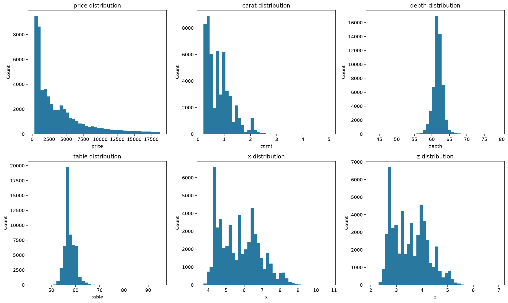

Price and carat are strongly right-skewed: many diamonds occupy the lower ranges and progressively
fewer observations appear at larger sizes and prices. Depth and table are much more concentrated.
The repeated peaks in physical dimensions reflect common commercial carat and size points rather
than normally distributed measurements.

### Numeric relationships

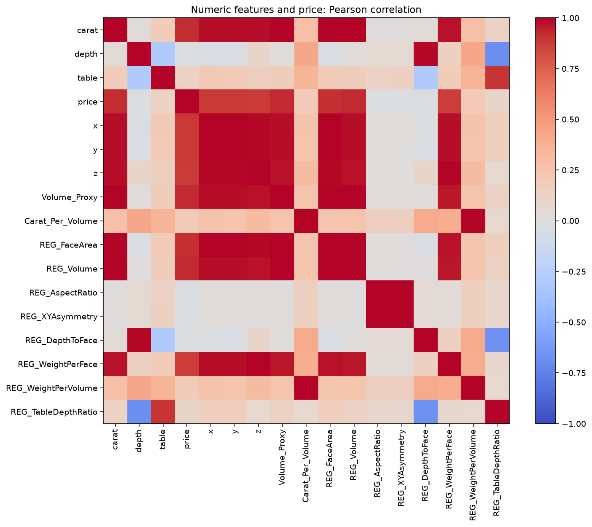

Carat, dimensions, face area, and volume move together and all have a strong relationship with
price. This explains why the project tested ratios, asymmetry, density-style measures, and human
features instead of treating every closely related size column as independent information.

## 2. Cleaning decisions

| Decision | Reason |
| --- | --- |
| Remove the exported index | It describes CSV position, not the diamond |
| Remove non-positive `x`, `y`, or `z` | A physical diamond cannot have a zero dimension |
| Investigate carat-to-volume relationships | Impossible geometry distorts size features |
| Check duplicates and missing values | Repetition or incomplete rows can bias evaluation |
| Preserve plausible unusual diamonds | Legitimate variation should not be removed only because it is rare |

Cleaning preserved physically realistic variation. Each workflow documents its exact row population because classification, regression, and clustering reproduce different maintained experiments.

## 3. Exploratory findings

| Finding | Result |
| --- | ---: |
| Basic valid unique profiles | 53,775 |
| Price range | $326–$18,823 |
| Median / mean price | $2,401 / $3,931.22 |
| Carat range | 0.20–5.01 |
| Median / mean carat | 0.70 / 0.798 |
| Most common cut | Ideal, 21,485 rows |
| Most common color | G, 11,254 rows |
| Most common clarity | SI1, 13,030 rows |

### Clarity

Carat, dimensions, cut, and color contained some clarity signal, but the original grades overlapped heavily. Professional clarity grading depends on microscopic inclusions that this dataset does not contain. Physical measurements could provide hints but could not reproduce grading reliably.

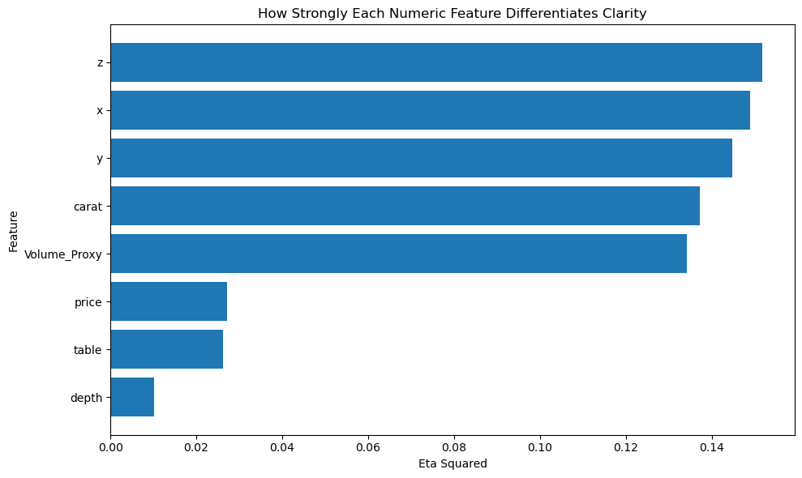

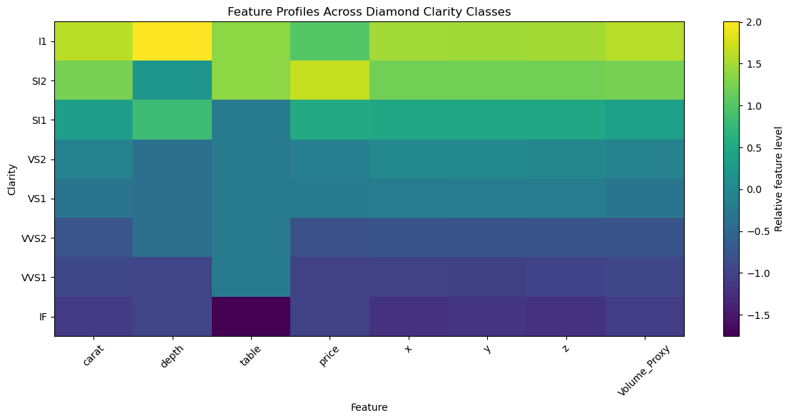

These historical EDA views were created before the final five-family target. They showed that size
and geometry change across clarity groups, but the profiles overlap instead of forming clean physical
boundaries. Price was investigated during EDA, then deliberately removed from the maintained clarity
pipeline because it is a market outcome rather than physical grading evidence.

### Price

Price had much stronger structure. Carat had the strongest simple numeric relationship with price (`r = 0.922`), followed by `x` (`0.887`), `z` (`0.868`), and `y` (`0.868`). Depth had almost no simple linear relationship (`-0.011`). Size explained much of price, while cut, color, clarity, proportions, and market thresholds explained differences between similarly sized diamonds.

## 4. Why the rows were engineered

Raw measurements tell the model what was measured. Engineered features express relationships a buyer or grader can interpret.

| Engineered idea | Reason |
| --- | --- |
| Face area and diagonal | Approximate visible size from above |
| Estimated volume | Combine all dimensions into a size proxy |
| Aspect ratio and asymmetry | Describe shape and dimensional balance |
| Depth-to-face and table-to-depth | Describe proportions rather than isolated measurements |
| Weight per face/volume | Show how carat is distributed physically |
| Physical density and proportion ratios | Describe geometry without using market price |
| Expected size at a carat weight | Compare whether a diamond faces up larger or smaller than peers |
| Distance from common carat thresholds | Represent buyer-relevant 0.5, 0.75, 1.0, 1.5, and 2.0 ct points |
| Peer rarity and quality-at-size | Add comparable market and buyer context |

### What feature engineering revealed

- Physical-only clarity models plateaued around the low-to-mid 50% range because geometry could not replace microscopic evidence.
- Price and every price-derived hint were removed from clarity classification because they introduced market information rather than physical clarity evidence.
- Mutual information ranks physical candidates on training rows, then correlation pruning removes redundant geometry before preprocessing.
- Estimated volume and visible size were useful concepts, but several ratios represented almost the same geometry. Extra redundant ratios increased complexity without reliable validation gains.
- Some raw features were weak or misleading alone. Depth barely correlated linearly with price, but proportion and interaction features helped interpret it in context.
- Human-readable regression features could not replace raw geometry. The hybrid representation was strongest.

The central finding was that a feature helped when it introduced a useful relationship. Adding columns alone did not improve a model.

### Geometry findings from the original EDA

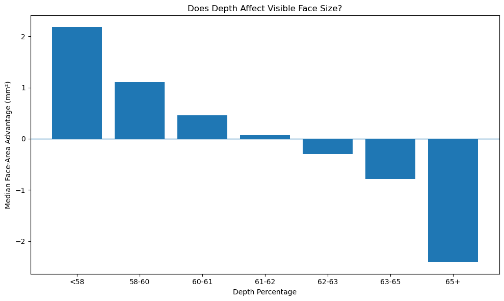

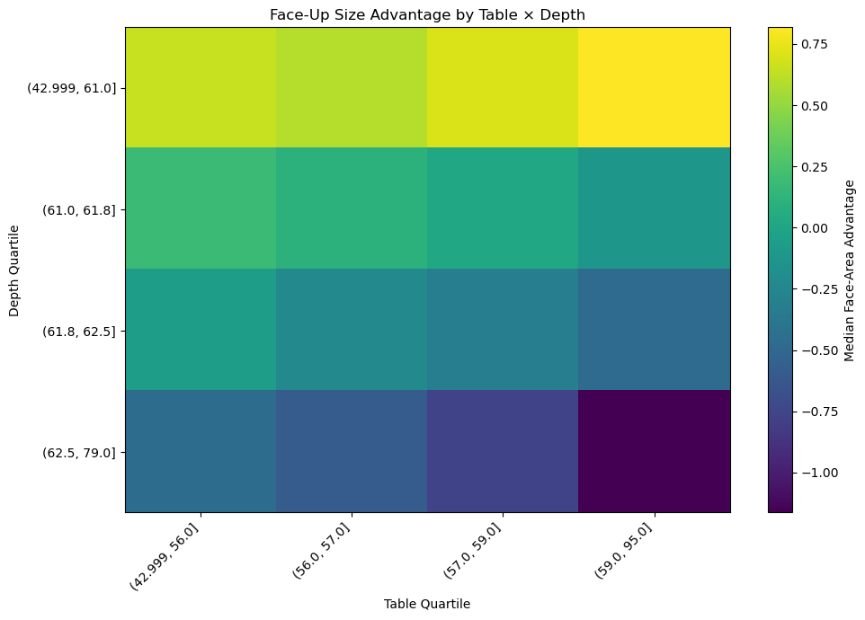

These plots explain why depth and table were retained in ratio and interaction features even though
depth alone had little linear correlation with price. Shallower proportions tended to produce more
visible face area, while deeper combinations tended to reduce face-up size.

## 5. Clarity classification

### Target

The eight original grades were grouped into five ordered families:

`I1 → I`, `SI1/SI2 → SI`, `VS1/VS2 → VS`, `VVS1/VVS2 → VVS`, `IF → IF`

The dataset lacks the microscopic evidence needed to separate every fine grade consistently. The five-family target better matches the available information.

### Shared physical-only comparison

All three maintained algorithms use the same 53,920 physically valid rows, the same stratified 70/15/15 split, and the same Y23 representation. The representation contains carat, dimensions, depth, table, cut, color, and physical ratios. It never contains `price` or a feature derived from price.

Feature selection is fitted only on training rows. Mutual information ranks numeric candidates, correlation pruning removes near-duplicates at a 0.75 threshold, numeric values are median-imputed and scaled, and cut/color are one-hot encoded.

The five clarity families are ordered, so each algorithm predicts four cumulative boundaries: above I, above SI, above VS, and above VVS. Those boundary probabilities are converted into the five final family probabilities.

### Model comparison and default selection

The maintained run trains exactly three models:

| Model | Shared steps | Recorded final validation result |
| --- | --- | ---: |
| Random Forest | Y23 physical features + ordinal boundaries | 55.91% accuracy; 44.00% Macro F1 |
| XGBoost | Y23 physical features + ordinal boundaries | **57.39% accuracy; 49.07% Macro F1** |
| ANN | Y23 physical features + four sigmoid ordinal outputs | 50.20% accuracy; 26.14% Macro F1 |

The maintained full run selected XGBoost with 57.39% validation accuracy, 50.21% macro precision, 49.37% macro recall, 49.07% macro F1, and 49.37% balanced accuracy. Its untouched-test result was 56.49% accuracy and 47.67% macro F1. Random Forest and ANN remain saved for comparison.

A completed training run calculates an equal-weighted **Balanced Selection Score** from macro precision, macro recall, macro F1, and balanced accuracy. The model with the highest validation score becomes the default saved classifier. All three artifacts remain available under `models/classification/ann`, `xgboost`, and `random_forest`.

Most errors occur between neighbouring families. Physical data cannot fully reproduce professional clarity grading because the dataset has no microscopic inclusion evidence.

## 6. Price regression

Price is the target. The shared split contains 37,729 training, 8,085 validation, and 8,085 test rows.

| Experiment | Question | Representation |
| --- | --- | --- |
| CURRENT_BASELINE | How well do original variables and initial physical features work? | Raw attributes + `REG_` geometry |
| HUMAN_ONLY | Can visible size, quality, thresholds, and peer context replace raw geometry? | Human features without direct x/y/z/depth/table |
| HUMAN_PLUS_RAW | Do both representations complement one another? | Human features + raw geometry |

| Experiment | Model | Inputs | Validation MAE | RMSE | R² | MAPE |
| --- | --- | ---: | ---: | ---: | ---: | ---: |
| CURRENT_BASELINE | XGBoost | 34 | $257.99 | $513.51 | 0.9827 | 6.05% |
| CURRENT_BASELINE | ANN | 34 | $336.90 | $631.47 | 0.9738 | 9.08% |
| CURRENT_BASELINE | Random Forest | 34 | $268.41 | $535.99 | 0.9811 | 6.64% |
| HUMAN_ONLY | XGBoost | 62 | $266.78 | $515.48 | 0.9825 | 7.32% |
| HUMAN_ONLY | ANN | 62 | $290.43 | $575.29 | 0.9782 | 7.79% |
| HUMAN_ONLY | Random Forest | 62 | $272.94 | $528.53 | 0.9816 | 7.92% |
| HUMAN_PLUS_RAW | XGBoost | 67 | **$253.80** | **$506.34** | **0.9831** | **5.99%** |
| HUMAN_PLUS_RAW | ANN | 67 | $279.49 | $552.22 | 0.9799 | 6.99% |
| HUMAN_PLUS_RAW | Random Forest | 67 | $261.69 | $522.61 | 0.9820 | 6.58% |

### Primary regression model

The required course model is HUMAN_PLUS_RAW XGBoost.

| Split | MAE | Median AE | RMSE | R² | MAPE | Within 10% |
| --- | ---: | ---: | ---: | ---: | ---: | ---: |
| Validation | $253.80 | $90.75 | $506.34 | 0.9831 | 5.99% | 82.00% |
| Test | **$245.44** | **$87.20** | **$505.07** | **0.9834** | **5.89%** | **82.46%** |

Human features added meaning but lost exact information when used alone. Combining human and raw features produced the strongest representation. The comparison ANN remains available at **$271.15 test MAE and 0.9798 R²**.

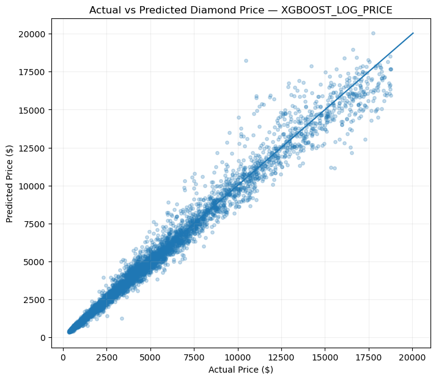

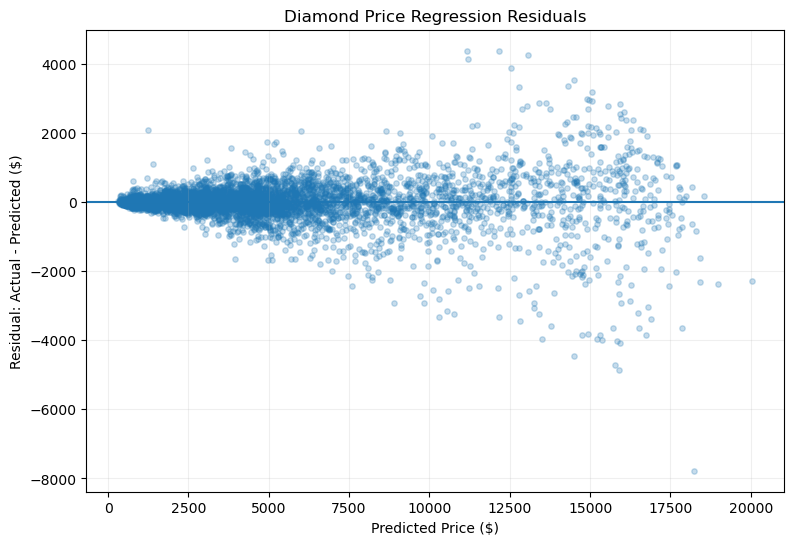

The historical regression diagnostics support two conclusions: predictions followed actual prices
closely across most of the range, while dollar errors spread out for expensive diamonds. That is why
the final evaluation reports both dollar and percentage errors, price-band results, and tail-error
percentiles instead of relying on a single overall score.

## 7. Buyer segmentation

### Objective and representation

Each valid diamond is treated as an anonymous purchase profile. Raw measurements are converted into eight customer-oriented pillars: visual presence, certificate quality, value, price level, quality balance, proportion consistency, rarity, and carat-milestone positioning. This gives the clusters a buyer-facing meaning while preventing raw `x/y/z` measurements from receiving equal weight simply because three geometry columns exist. Rows with several extreme geometry signals are held out before clustering so measurement anomalies cannot become fake customer segments.

### Methods and selection

K-Means, diagonal Gaussian Mixture Models, and sampled Ward Agglomerative clustering were each tested at K = 3, 5, 7, and 10. Selection combines silhouette, Davies-Bouldin, Calinski-Harabasz, cluster balance, minimum and maximum cluster share, centroid separation, within-cluster spread, stability or membership confidence, coverage, and an interpretability score that discourages unnecessary fragmentation.

| Solution | K | Silhouette | Stability ARI | Davies-Bouldin | Smallest segment | Selection score |
| --- | ---: | ---: | ---: | ---: | ---: | ---: |
| **K-Means** | **5** | **0.171** | **0.982** | **1.730** | **10.60%** | **0.732** |
| K-Means | 3 | 0.179 | 0.992 | 1.926 | 30.16% | 0.700 |
| K-Means | 10 | 0.148 | 0.988 | 1.642 | 7.53% | 0.698 |
| Agglomerative | 5 | 0.155 | n/a | 1.854 | 11.90% | 0.670 |
| GMM | 3 | 0.155 | membership confidence 0.897 | 2.049 | 27.95% | 0.651 |

K-Means with K = 5 was selected. K = 10 achieved tighter mathematical separation but divided the market into twice as many profiles; the practical selection score favored K = 5 because it retained strong stability and sensible segment sizes while producing a more understandable set of archetypes. DBSCAN and HDBSCAN were explored earlier but were not retained because they collapsed the market into a dominant density group or labelled too many rows as noise.

### Final product-derived archetypes

| Buyer-preference archetype | Share | Typical diamond | Main priorities | Main trade-off |
| --- | ---: | --- | --- | --- |
| Premium Visual-Impact Seekers | 14.54% | 1.23 ct, $7,363, Ideal, SI | visible size, price tier, rarity | milestone positioning |
| Milestone-Conscious Value Buyers | 25.32% | 0.76 ct, $3,239, Ideal, SI | carat milestone, value, proportions | quality balance |
| Quality-Conscious Budget Buyers | 29.24% | 0.33 ct, $772, Ideal, VS | certificate quality, proportions, value | higher price tier |
| Balanced Mid-Market Pragmatists | 20.30% | 0.72 ct, $2,639, Very Good, SI | quality balance, rarity, milestone | value emphasis |
| Rarity / Distinctiveness Seekers | 10.60% | 1.00 ct, $3,853, Good, SI | rarity, visible size, milestone | proportion consistency |

The full comparison is saved in `outputs/clustering/tables/method_comparison.csv`. The enriched dataset is saved as `diamonds_with_customer_profiles.csv`, and the reusable structured registry is saved under `models/clustering/profile_registry.json`.

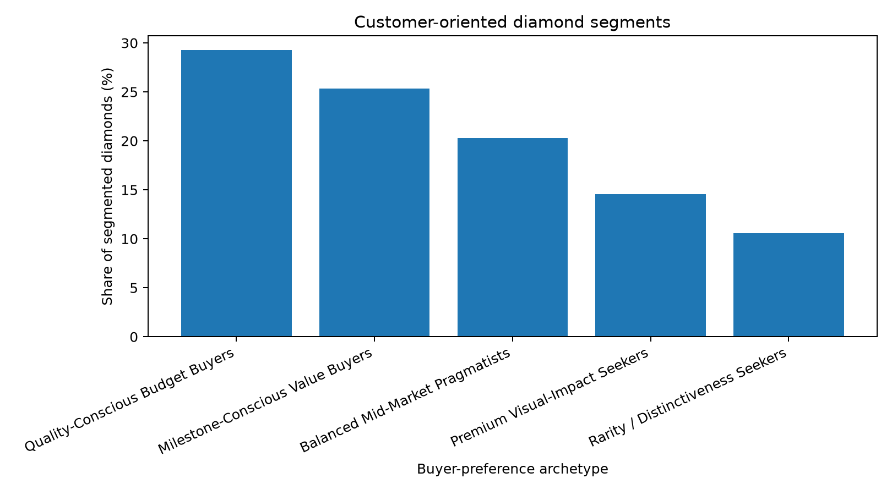

The segment-size chart verifies that every selected group represents a meaningful part of the market.

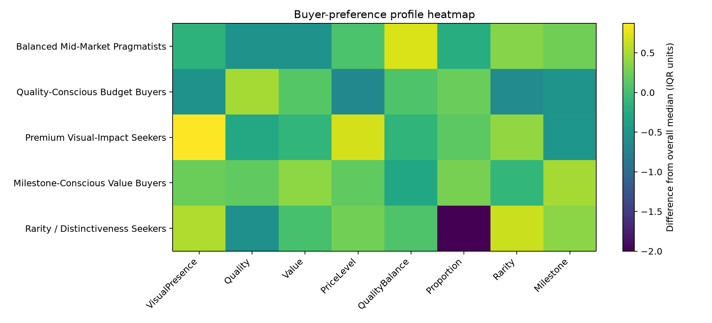

The heatmap shows how each profile differs from the overall dataset across the eight preference pillars.

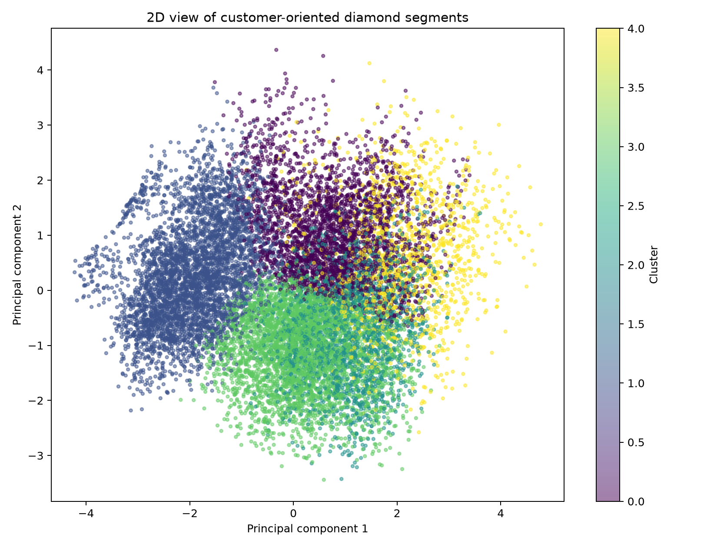

The PCA view is a two-dimensional documentation aid. Overlap is expected because diamond preferences form a continuum.

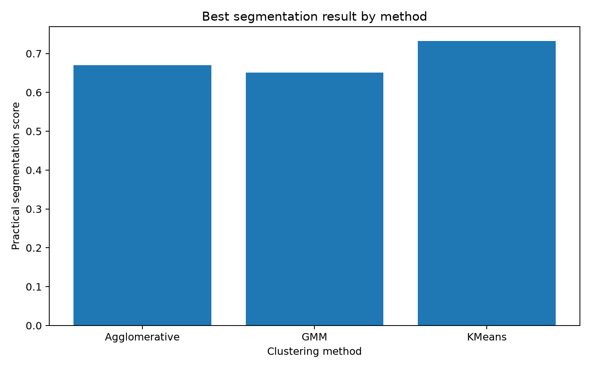

The method comparison shows the best practical score achieved by each retained clustering family.

> **Interpretation limitation:** these profiles are product-derived buyer-preference archetypes and are not validated psychological customer segments.

Run the complete workflow with `python scripts/run_clustering.py`, or use `python scripts/run_clustering.py --smoke` for a quick structural check. Application code can pass an existing cleaned DataFrame directly to `run_segmentation(df)` without loading the CSV again.

## 8. AI diamond assistant

The assistant lets users ask ordinary questions instead of inspecting tables, notebooks, and model files.

| Need | Component |
| --- | --- |
| Exact dataset constraints | Pandas search |
| Ranked alternatives | Auditable filtering, ranking, and result diversity |
| Price estimate | Saved HUMAN_PLUS_RAW XGBoost regressor |
| Clarity estimate | Saved validation-selected classifier |
| Buyer segment | Saved multi-method segmentation pipeline and profile registry |
| Project/domain explanation | Heading-aware hybrid retrieval + Chroma RAG |
| Current search preferences | Compact structured conversation state |
| Natural response | Local Qwen through Ollama |

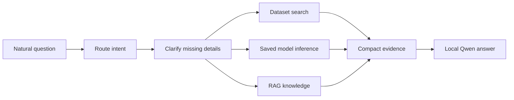

Deterministic tools perform calculations and filtering. RAG uses twelve focused knowledge documents, heading-aware chunks, embeddings, lexical reranking, and deterministic topic expansion. The LLM explains bounded evidence rather than memorizing 53,000 rows or inventing predictions. Greetings and direct dataset operations skip RAG entirely.
Exact count requests use Pandas and return directly without an embedding or LLM call. Each chat
passes only its compact filters and latest exchange instead of repeatedly sending the full history.

### Assistant code organization

The live assistant is divided into focused files instead of one large chatbot script:

| File | Responsibility |
| --- | --- |
| `routing.py` | Choose one of seven supported intents and its evidence source |
| `search_planning.py` | Extract and validate budget, size, category, and follow-up search state |
| `clarification.py` | Normalize text and extract saved-model inputs |
| `data_analysis.py` | Execute clear statistics, trends and price analysis with Pandas |
| `dataset_search.py` / `comparison.py` | Search real rows and compare only displayed results |
| `domain_answers.py` | Answer fixed cut, color, clarity, and profile vocabulary directly |
| `retrieval.py` / `vector_store.py` | Retrieve grounded project and diamond knowledge |
| `model_evidence.py` | Call saved price, clarity, and segmentation artifacts |
| `tool_executor.py` | Validate and execute combined model requests |
| `prompt_builder.py` / `generation.py` | Build compact evidence and stream the final natural-language response |
| `service.py` | Orchestrate the complete request and expose developer audit evidence |
| `api.py` | Serve the React client over HTTP and streamed NDJSON |

Historical V8.4 control-plane modules remain under `src/assistant/legacy/` for evaluation and design
reference. They are not called by the live React/backend request path.

### React frontend

The primary web interface now lives in `frontend/`. It is a Vite/React client with the crystal-blue visual system, browser-local conversation history, compact state, streamed NDJSON responses, and natural-language recommendation cards.

```text
React :5173 → HTTP /chat/stream → local assistant API :8770 → data/models/Chroma/Ollama
```

Terminal 1:

```powershell
python -m src.assistant.api --port 8770
```

Terminal 2:

```powershell
cd frontend
npm install
npm run dev
```

Open `http://127.0.0.1:5173`. Vite proxies assistant requests to the local backend during development. A production deployment can set `VITE_ASSISTANT_API_URL` and the optional matching API token.

### Legacy Streamlit fallback

**One-process local mode:**

```text
Browser → Streamlit → local data/models/Chroma/Ollama
```

Run `python -m streamlit run app.py`. Everything stays on the computer. The cached assistant
loads Qwen before the chat becomes ready, then streams generated text into the active message.
Dataset rows and developer evidence appear when generation finishes.

**Separated frontend and local backend:**

```text
Streamlit → HTTP /chat/stream → local assistant API → data/models/Chroma/Ollama
```

Terminal 1:

```powershell
$env:DIAMOND_ASSISTANT_API_TOKEN="choose-a-long-random-token"
python -m src.assistant.api --port 8770
```

Terminal 2:

```powershell
$env:DIAMOND_ASSISTANT_API_URL="http://127.0.0.1:8770"
$env:DIAMOND_ASSISTANT_API_TOKEN="choose-a-long-random-token"
python -m streamlit run app.py
```

A hosted frontend cannot reach your computer at `127.0.0.1`. To keep inference local, expose port 8770 through an authenticated HTTPS tunnel and configure the React frontend with that URL and the same token. The computer, API, Ollama, and tunnel must remain running.

Normal mode shows chat and recommendations. Developer mode uses the same response but also shows routing, filters, embedding queries, retrieved chunks and scores, model status, memory, and compact evidence.

## 9. Final artifact overview

| Component | Selected approach | Purpose |
| --- | --- | --- |
| Clarity | Selected physical-only model | Predict five ordered clarity families |
| Clarity alternatives | ANN, XGBoost, Random Forest | Compare one shared representation |
| Price | HUMAN_PLUS_RAW XGBoost | Required and selected regression model |
| Price alternatives | ANN and Random Forest | Same-split algorithm comparison |
| Segmentation | K-Means, K = 5 | Describe buyer-preference product profiles |
| Retrieval | Pandas + embeddings/Chroma | Exact matches and explanations |
| Assistant | Router + local Qwen | Combine evidence naturally |

## 10. Main conclusions

1. Useful relationships such as visible size, value per size, and peer context added meaning beyond raw measurements.
2. Redundant ratios did not automatically improve performance.
3. Missing microscopic information limited physical-only clarity prediction.
4. Price was easier to predict because the dataset contained its strongest drivers.
5. Model failure revealed real limits in the data and domain.
6. Human regression features complemented raw measurements but could not replace them.
7. Five stable preference profiles balanced mathematical separation with practical interpretation.
8. Structured data, ML, RAG, and language generation each solved a different assistant problem.

## 11. Limitations

- No microscopic inclusion information.
- No customer IDs, demographics, or repeated purchases.
- Clarity estimation uses physical and categorical attributes only; price estimation uses known clarity as an input.
- Purchase profiles overlap and are product-derived archetypes, not fixed buyer personalities.
- The selected K-Means result uses hard, roughly spherical groups even though GMM and hierarchical alternatives were also evaluated.
- Local RAG depends on curated knowledge, embeddings, and a small local LLM.
- Historical Kaggle data may not represent every current market.
- A hosted frontend depends on the local backend and secure tunnel remaining online.

## 12. Possible Improvements

This project answered the main questions I set out to explore, but it also revealed several areas where additional research and experimentation could improve the system.

### Classification

The clarity classification experiments showed that the features available in the Diamonds dataset provide useful information, but they do not contain everything that determines a professional clarity grade. Physical measurements and engineered geometric features provided some signal, but the dataset still lacks microscopic inclusion evidence.

With more time, I would:

* **Research additional diamond datasets** to see whether other datasets contain features that are more directly related to clarity, such as inclusion characteristics, grading information, or more detailed quality measurements.
* **Research the diamond-grading process further** and identify additional features that could realistically be approximated from structured data.
* **Experiment with more sophisticated classification approaches** rather than stopping with the ANN, Random Forest, and XGBoost models used in this project.
* **Investigate more advanced feature engineering** based specifically on how clarity is determined, rather than creating additional generic mathematical ratios.
* Continue refining the **ordered classification** design now used for I → SI → VS → VVS → IF.
* Investigate external physical or grading information that improves clarity prediction without using price as a proxy.

The main question for future classification work would be:

> **Can additional domain-specific data or better feature representations recover more of the information that is currently missing from the dataset?**

### Regression

The price regression models performed very well on the current dataset, but they mainly learn the pricing relationships contained within that particular dataset.

Diamond prices in the real market can also be affected by factors that are not represented here.

With more time, I would:

* **Research the diamond industry and pricing process more deeply** to understand what additional factors influence real market prices.
* Add **market trends and time-based information**, since diamond prices may change across different years and market conditions.
* Investigate factors such as current demand, supply, certification, retailer differences, natural versus lab-grown diamonds, and other market conditions where suitable data is available.
* Test the model on **external diamond datasets** to determine whether the relationships learned from this dataset generalize to other markets.
* Continue experimenting with combinations of raw and engineered features to determine whether the same accuracy can be achieved with a smaller and simpler feature set.

The next regression question would therefore move beyond:

> **“Can I predict the price in this dataset?”**

toward:

> **“Can I predict a realistic diamond market price when market conditions and external pricing factors are also considered?”**

### Clustering and Buyer Segmentation

K-Means with **K = 5** produced the most useful practical segmentation after comparing K-Means, Gaussian mixtures, and hierarchical clustering. Its **0.171 silhouette** shows that the groups overlap, while its **0.982 stability ARI** shows that repeated fits recover a similar structure.

The current work compares three useful clustering families, but it still assigns a single profile to each product and evaluates stability most directly for K-Means.

With more time, I would:

* Extend stability analysis to Gaussian mixtures and hierarchical clustering using repeated samples.
* Investigate soft profile membership so borderline diamonds can express more than one preference pattern.
* Compare whether alternative methods produce clusters with **better separation and more meaningful business interpretations**.
* Investigate whether the current feature combination causes some dimensions, such as price or diamond size, to influence the segments more strongly than intended.
* Experiment with clustering **different groups of features separately**, such as value-related features, quality-related features, and physical-size features.
* Study the five current profiles in greater detail to understand **why certain purchases sit between multiple groups**.
* Investigate whether the moderate silhouette score reflects a limitation of K-Means or whether diamond purchasing behaviour genuinely exists on a continuous spectrum without sharply separated groups.

The most important future clustering question would be:

> **Are three overlapping groups genuinely the natural structure of the data, or could a different clustering approach reveal a stronger and more useful segmentation?**

### AI Assistant and RAG

The current assistant uses a hybrid approach because different questions are better handled by different components: structured dataset filtering, machine-learning models, vector retrieval, and the language model.

The architecture works, but it was designed primarily to make the complete system functional. It was **not heavily optimized for token efficiency, retrieval efficiency, or advanced orchestration**.

With more time, I would focus heavily on this area.

I would:

* Improve **query rewriting**, so a user's original question can be converted into a shorter and more precise search or retrieval query before reaching the vector database.
* Investigate ways to **accomplish the same task with significantly less prompt context**, rather than repeatedly sending unnecessary information to the language model.
* Store and reuse compact structured information from previous turns instead of repeatedly including large portions of conversation history.
* Improve retrieval so that only the **smallest amount of relevant evidence** needed to answer the question is placed into the final prompt.
* Experiment with better chunking and retrieval strategies to reduce irrelevant RAG context.
* Measure **token usage, retrieval size, response quality, and latency** instead of evaluating the assistant mainly by whether it produces a correct response.
* Research more sophisticated **routing and orchestration designs** for systems that combine structured data, RAG, ML models, and conversational state.
* Investigate frameworks such as **LangChain or LangGraph** to determine whether they could simplify routing, multi-step workflows, tool use, and conversation-state management.
* Compare those frameworks against the current custom implementation rather than assuming that using an orchestration framework automatically produces a better system.
* Develop a more formal assistant evaluation set containing different types of questions, such as filtering, price prediction, clarity prediction, explanations, recommendations, and multi-turn questions.

The longer-term goal would be to make the assistant **more efficient rather than simply larger**:

> **Retrieve less, send less, reuse useful context, and still produce the same or better answer.**

### Overall Future Direction

The next version of the project would focus less on simply adding more models and more features and more on investigating the limitations discovered during this version.

The main questions I would explore are:

* **Classification:** Can better domain data and more sophisticated features reduce the information gap in clarity prediction?
* **Regression:** Can market and industry information make price prediction representative of the real diamond market rather than only this dataset?
* **Clustering:** Is K-Means actually the best representation of purchase behaviour, or can another method find stronger and more interpretable groups?
* **Assistant:** Can the same hybrid system answer complex questions using substantially less retrieved context and fewer tokens?

These improvements follow directly from the findings and limitations discovered during the project rather than simply adding additional technology for its own sake.

## Technical documentation

Repository structure, file responsibilities, training, APIs, tests, Docker, CI/CD, artifacts, and troubleshooting are documented in [docs/TECHNICAL_README.md](docs/TECHNICAL_README.md).

## Repository

[github.com/AliH7861/diamonds-predictor-application](https://github.com/AliH7861/diamonds-predictor-application)

