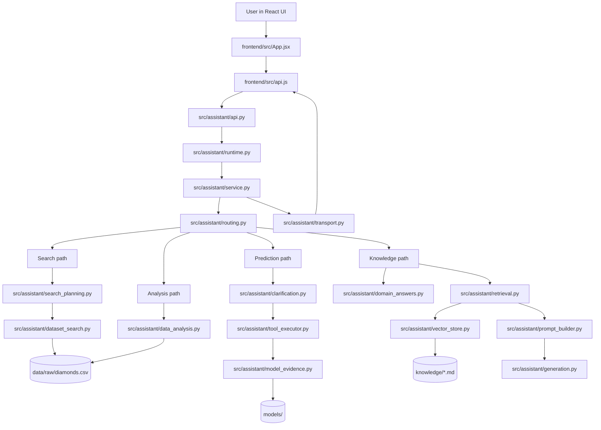
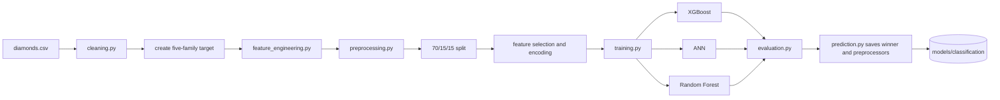
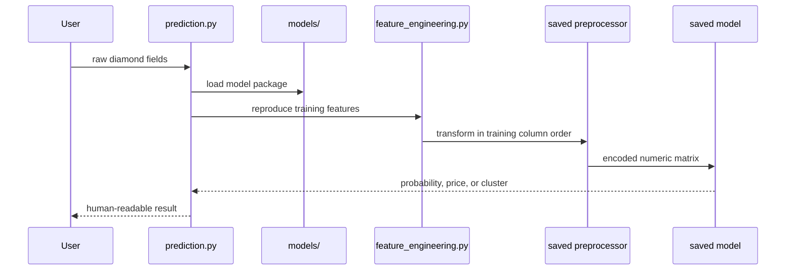
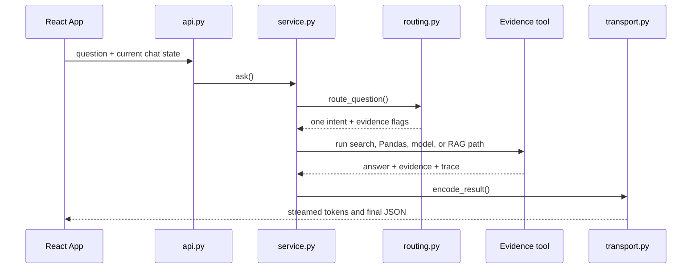
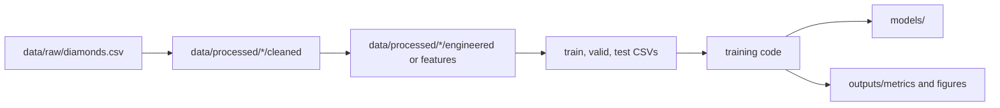
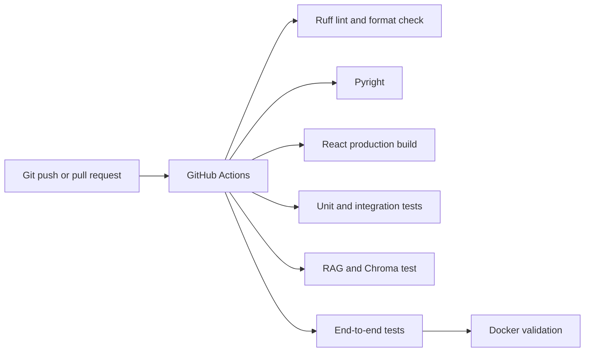
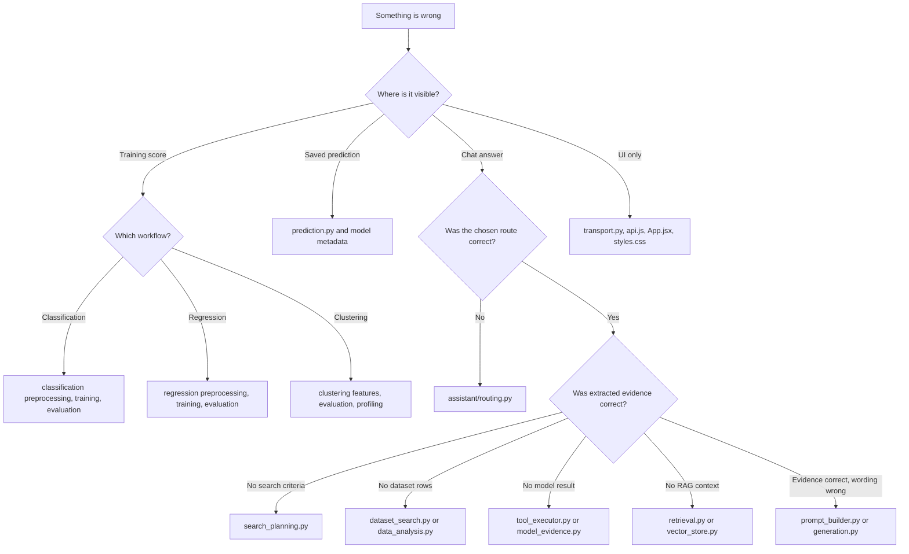

# Diamond Project — System Architecture and File Guide

This document is a personal reference for understanding the complete codebase. It explains what
each important file owns, how information moves between files, where outputs are saved, and where
to start when something goes wrong.

## How to use this guide

You do not need to understand every file at once. Learn the system in this order:

1. Read the [five-part mental model](#1-the-five-part-mental-model).
2. Follow one [end-to-end flow](#4-end-to-end-flows).
3. Use the [file catalog](#5-file-by-file-catalog) only when you need a specific detail.
4. Use the [debugging map](#10-debugging-map) when behaviour is wrong.

---

## 1. The five-part mental model

The repository has five main jobs:

| Part | What it does | Main location |
| --- | --- | --- |
| Data and research | Stores raw data, processed data, and notebooks | `data/`, `sideEDA/`, `notebooks/` |
| Model training | Cleans data, engineers features, trains models, evaluates results | `src/classification/`, `src/regression/`, `src/clustering/` |
| Saved inference | Reloads trained artifacts and predicts without training | `models/` and each package's `prediction.py` |
| Assistant backend | Routes questions to data, models, or RAG | `src/assistant/` |
| User interface and quality checks | Displays chat and verifies behaviour | `frontend/`, `tests/`, `.github/workflows/` |

### The shortest possible explanation

```text
Raw CSV
  → model-specific cleaning and feature engineering
  → training and evaluation
  → saved model artifacts
  → assistant backend chooses the correct artifact or evidence tool
  → React frontend displays the result
```

---

## 2. Complete system diagram



The central file is `src/assistant/service.py`. It does not perform every task itself. It routes
work to a specialized module and then packages the result.

---

## 3. What is live, supporting, generated, or legacy?

| Status | Meaning | Examples |
| --- | --- | --- |
| **Live runtime** | Called while the React application is running | `assistant/service.py`, `routing.py`, `dataset_search.py` |
| **Training/support** | Used to create models, reports, or diagnostics | `classification/training.py`, `scripts/train_all_models.py` |
| **Generated artifact** | Created by training or evaluation; normally read rather than edited | `models/`, `outputs/`, `data/processed/`, `vector_db/` |
| **Research/history** | Preserves notebook exploration and older experiments | `sideEDA/`, `notebooks/01_old_eda.ipynb` |
| **Legacy assistant** | Older V8.4 control-plane research, not called by the live service | `src/assistant/legacy/` |

This distinction is important: a file can be useful documentation without being part of the live
application path.

---

## 4. End-to-end flows

## 4.1 Classification training



**Entry point:** `scripts/train_all_models.py → train_classification()`

**Important rule:** price never enters the clarity feature matrix.

## 4.2 Regression training

```mermaid
flowchart LR
    A[diamonds.csv] --> B[regression/cleaning.py]
    B --> C[engineer_base_features]
    C --> D[shared 70/15/15 split]
    D --> E[fit_human_context on train only]
    E --> F[prepare three feature sets]
    F --> G[3 feature sets x 3 algorithms]
    G --> H[full_regression_metrics]
    H --> I[select with validation MAE]
    I --> J[held-out test evaluation]
    J --> K[(models/regression)]
```



**Entry point:** `scripts/train_all_models.py → train_regression()`

**Important rule:** learned peer profiles, rarity counts, and expected-size models are fitted using
training rows only.

## 4.3 Clustering training


**Entry point:** `scripts/run_clustering.py → run_buyer_segmentation()`

## 4.4 Saved-model prediction



The saved package matters because inference must use exactly the same transformations learned
during training.

## 4.5 Assistant request



### The seven live assistant routes

| Intent | Method called in `service.py` | Main evidence |
| --- | --- | --- |
| `search` | `_search()` | Real dataset rows |
| `compare` | `_compare()` | Rows already displayed in this chat |
| `dataset_analysis` | `_analyze()` | Pandas calculation |
| `diamond_knowledge` | `_knowledge()` | Fixed answer or RAG chunks |
| `model_prediction` | `_predict()` | Saved artifacts |
| `small_talk` | `_small_talk()` | Direct short response |
| `out_of_scope` | `_out_of_scope()` | Boundary response |

---

## 5. File-by-file catalog

## 5.1 Root files

| File | Responsibility | Read/edit when |
| --- | --- | --- |
| `README.md` | Main public project documentation | Updating repository-facing results or setup |
| `CAPSTONE_PRESENTATION_README.md` | Presentation narrative, metrics, findings, and prepared questions | Preparing the capstone presentation |
| `SYSTEM_ARCHITECTURE_README.md` | This internal technical map | Learning or debugging the codebase |
| `config.py` | Shared root paths and random seed | Dataset/output locations change |
| `app.py` | Optional Streamlit entry point | Running or changing the legacy UI |
| `requirements.txt` | Complete local Python dependency list | Building the full local environment |
| `requirements-ci.txt` | Smaller CI dependency set | GitHub Actions installation changes |
| `requirements-training.txt` | Extra full-training dependencies | Docker training requirements change |
| `requirements-assistant.txt` | Assistant-specific dependencies | Installing only the assistant stack |
| `requirements-rag-ci.txt` | Chroma/RAG CI additions | RAG CI dependencies change |
| `requirements-frontend.txt` | Frontend-related environment reference | Frontend packaging changes |
| `pyproject.toml` | Ruff and Pyright configuration | Formatting, linting, or typing rules change |
| `.pre-commit-config.yaml` | Checks run before commits | Pre-commit behaviour changes |
| `Dockerfile` | Reproducible CI/test image | Container validation changes |
| `Dockerfile.train` | CPU-only full training image | Model-training container changes |
| `pytest.ini` | Pytest discovery/configuration | Test selection or markers change |

## 5.2 Shared source

| File | Main responsibility | Important public function |
| --- | --- | --- |
| `src/datasets.py` | Load the original diamond table and verify the ten expected columns | `load_diamond_frame()` |
| `src/__init__.py` | Marks `src` as a Python package | None |

The shared loader performs only general validation. Each model package then applies its own
cleaning rules because classification, regression, and clustering have different objectives.

## 5.3 Classification package

| File | What it owns | Called by / calls |
| --- | --- | --- |
| `classification/cleaning.py` | Required-column checks, physical-row cleaning, and five-family target mapping | Called by `preprocessing.py` |
| `classification/feature_engineering.py` | Physical-only Y23 geometry, symmetry, density, and interaction features | Called by `preprocessing.py` and inference |
| `classification/preprocessing.py` | Shared split, mutual-information selection, correlation pruning, scaling, and encoding | Called by training scripts |
| `classification/ordinal.py` | Converts labels to cumulative boundaries and probabilities back to five classes | Used by training and prediction |
| `classification/model.py` | Builds ANN architectures | Called by `training.py` and model tests |
| `classification/training.py` | Trains XGBoost, ANN, or Random Forest candidates and evaluates test data | Called by `scripts/train_all_models.py` |
| `classification/evaluation.py` | Accuracy, precision, recall, F1, balanced accuracy, and ordinal error metrics | Called after predictions |
| `classification/prediction.py` | Saves, loads, and runs complete classification artifacts | Called by scripts, API, and assistant model evidence |
| `classification/diagnostics.py` | Feature ranking and diagnostic plots | Used by notebooks/research |
| `classification/datasets.py` | Intended to export cleaned, engineered, split, and encoded CSVs | Supporting/notebook file; not on live inference path |
| `classification/api.py` | Standalone classification-only prediction server | Optional; the main React app uses assistant `api.py` |
| `classification/__init__.py` | Package marker and scope description | Imported when using the package |

### Classification data objects

`prepare_classification_data()` returns a dictionary containing:

```text
cleaned and engineered DataFrames
train/validation/test row indices
selected numeric features and mutual-information ranking
fitted preprocessor
X_train, X_valid, X_test
y_train, y_valid, y_test
```

That one prepared object ensures every candidate receives the same data.

## 5.4 Regression package

| File | What it owns | Called by / calls |
| --- | --- | --- |
| `regression/config.py` | Paths, seed, and tuned tree parameters | Imported throughout regression |
| `regression/cleaning.py` | Price-workflow cleaning and removed-row tracking | Called by `preprocessing.py` |
| `regression/feature_engineering.py` | Baseline geometry, training-only human context, market milestones, peer features, and feature-set definitions | Called by preprocessing and inference |
| `regression/preprocessing.py` | Shared split and preparation of CURRENT_BASELINE, HUMAN_ONLY, and HUMAN_PLUS_RAW | Called by training scripts |
| `regression/model.py` | Builds the regression ANN | Called by `training.py` |
| `regression/training.py` | Trains candidates, selects by validation MAE, and evaluates test data | Called by `scripts/train_all_models.py` |
| `regression/evaluation.py` | Full regression metrics and price-band reports | Called by training and notebooks |
| `regression/prediction.py` | Persists the context, preprocessor, and model; reloads them for prices | Called by assistant and saved-model checks |
| `regression/datasets.py` | Exports experiment DataFrames and statistics | Used by notebooks/documentation |
| `regression/visualizations.py` | EDA, comparisons, feature importance, actual-vs-predicted, and error plots | Used by notebooks/reports |
| `regression/api.py` | Standalone regression-only prediction server | Optional; assistant API is the combined application API |
| `regression/__init__.py` | Defines package scope: price target, clarity input | Package import |

### Regression prepared object

```text
original and cleaned tables
raw shared train/validation/test splits
training-only human context
human-feature versions of every split
three feature experiments
encoded matrices and fitted preprocessors
price target arrays
```

### Saved-artifact detail to remember

`train_all_models.py` saves the validation-MAE winner at the main regression model path. The
required HUMAN_PLUS_RAW XGBoost model is therefore the artifact loaded by the assistant. The ANN
is retained under `models/regression/ann/`, and the benchmark-winner directory preserves a named
copy of the overall comparison winner.

## 5.5 Clustering package

| File | What it owns | Called by / calls |
| --- | --- | --- |
| `clustering/config.py` | Candidate K values, anomaly rules, sampling, and random seed | Passed through the pipeline |
| `clustering/models.py` | Typed `SegmentProfile` and `SegmentationResult` result objects | Returned by pipeline/profiling |
| `clustering/feature_engineering.py` | Input validation, base features, anomaly separation, and eight customer pillars | First pipeline transformation |
| `clustering/preprocessing.py` | Compatibility entry points for file-backed or existing DataFrames | Reuses feature engineering |
| `clustering/clustering.py` | K-Means, GMM, and Agglomerative candidate execution | Called by `pipeline.py` |
| `clustering/evaluation.py` | Separation, balance, stability, confidence, interpretability, and winner selection | Evaluates all candidates |
| `clustering/profiling.py` | Describes clusters in original units and assigns buyer-facing names | Runs after winner selection |
| `clustering/prediction.py` | Reloads the saved scaler/model and assigns a new profile | Called by assistant model evidence |
| `clustering/rag.py` | Converts profiles into knowledge records and answers profile lookups | Used during persistence and assistant support |
| `clustering/visualizations.py` | Segment size, heatmap, PCA, and method-comparison images | Called by full pipeline |
| `clustering/pipeline.py` | Orchestrates every stage and persists all selected artifacts | Main package entry point |
| `clustering/__init__.py` | Package marker | Package import |

`SegmentationPipeline.run()` is the main in-memory API. `run_buyer_segmentation()` adds file
loading and persistence around that API.

## 5.6 Assistant package: live files

| File | What it owns | What it should not own |
| --- | --- | --- |
| `assistant/api.py` | HTTP endpoints, CORS, authorization, streaming events | Routing or model logic |
| `assistant/runtime.py` | Creates the dataset, Ollama client, Chroma stores, model provider, and service once | Per-question decisions |
| `assistant/service.py` | Central orchestration, intent dispatch, result packaging, and diagnostics | Low-level filtering or embedding algorithms |
| `assistant/routing.py` | Chooses exactly one high-level intent and evidence policy | Performing the requested task |
| `assistant/schemas.py` | Shared route, query-plan, retrieval, and memory data shapes | Execution logic |
| `assistant/clarity.py` | Maps detailed clarity grades to I, SI, VS, VVS, or IF | Model inference |
| `assistant/clarification.py` | Normalizes natural language and extracts model inputs; also retains compatibility intake code | Dataset filtering |
| `assistant/search_planning.py` | Builds and validates one search plan from the message and current-chat state | Applying filters to the DataFrame |
| `assistant/dataset_search.py` | Applies exact constraints, ranks candidates, diversifies results, and records a trace | Interpreting natural language |
| `assistant/comparison.py` | Compares only rows already displayed in the current chat | Searching unseen rows |
| `assistant/data_analysis.py` | Runs counts, ranges, distributions, correlations, and grouped statistics using Pandas | Free-form generation |
| `assistant/domain_answers.py` | Returns short authoritative vocabulary answers | Open-ended RAG |
| `assistant/retrieval.py` | Creates focused knowledge queries and filters retrieved chunks | Storing embeddings |
| `assistant/vector_store.py` | Chunks Markdown, manages Chroma, embeds queries, and scores stored content | Final response writing |
| `assistant/prompt_builder.py` | Compacts rows and knowledge into clearly labeled evidence and a bounded prompt | Calling Ollama directly |
| `assistant/generation.py` | Local Ollama chat, structured output, embeddings, warmup, and streaming | Routing |
| `assistant/model_evidence.py` | Loads and executes real classification, regression, and clustering artifacts | Natural-language input routing |
| `assistant/tool_executor.py` | Validates and executes combined saved-model requests | Loading HTTP requests |
| `assistant/transport.py` | Converts state, conversation, DataFrames, NumPy values, and results to safe JSON | Business decisions |
| `assistant/config.py` | Model names, paths, Ollama URL, and evidence limits | Runtime execution |
| `assistant/__init__.py` | Lazy public imports | Business logic |

### What `service.py` contains

| Method | Purpose |
| --- | --- |
| `ask()` | Public entry point and diagnostic wrapper |
| `_ask()` | Routes and dispatches one request |
| `_search()` | Plans and executes a dataset search |
| `_compare()` | Compares displayed rows |
| `_analyze()` | Executes Pandas analysis |
| `_knowledge()` | Uses fixed answers first, then RAG |
| `_predict()` | Parses and executes saved-model requests |
| `_small_talk()` | Handles simple conversation without tools |
| `_out_of_scope()` | Returns the supported-scope boundary |

### Assistant startup

```text
api.py main()
  → create_server()
  → runtime.py create_assistant()
       → load DiamondCatalog
       → create OllamaClient
       → create/index ChromaStores
       → create KnowledgeRetriever
       → load ModelEvidenceProvider artifacts
       → create DiamondAssistant
  → listen on port 8770
```

Models and knowledge stores are created once at startup instead of being reloaded for every
message.

## 5.7 Assistant legacy and optional UI files

The following files are not part of the main React request path.

| File/folder | Purpose |
| --- | --- |
| `assistant/legacy/text_preprocessing.py` | Older canonical-message model |
| `assistant/legacy/concepts.py` | Older explicit concept-evidence mapping |
| `assistant/legacy/state_management.py` | Older transactional state-delta model |
| `assistant/legacy/request_validation.py` | Older field-level evidence checks |
| `assistant/legacy/request_types.py` | Older typed tool requests |
| `assistant/legacy/control_plane.py` | Older combined preparation/control stage |
| `assistant/legacy/execution_policy.py` | Older token-spending policy |
| `assistant/streamlit_app/client.py` | HTTP client for separated Streamlit/backend mode |
| `assistant/streamlit_app/ui.py` | Optional Streamlit chat workspace |
| `app.py` | Starts the optional Streamlit UI |

The legacy modules remain useful for historical V8.4 tests and design comparison. Editing them
will not normally change what the React application does.

## 5.8 React frontend

| File | Responsibility |
| --- | --- |
| `frontend/src/main.jsx` | Mounts the React application into the page |
| `frontend/src/App.jsx` | Conversation state, chat history, message rendering, match tables, developer trace, theme, and interactions |
| `frontend/src/api.js` | Calls `/health` and streams `/chat/stream` NDJSON events |
| `frontend/src/styles.css` | Responsive desktop, tablet, mobile, dark, and light visual styling |
| `frontend/vite.config.js` | Runs port 5173 and proxies `/assistant-api` to backend port 8770 |
| `frontend/package.json` | Frontend dependencies and npm scripts |
| `frontend/package-lock.json` | Reproducible exact npm dependency versions |
| `frontend/.env.example` | Optional hosted backend URL/token variables |
| `frontend/README.md` | Frontend-specific startup notes |

### Browser state

`App.jsx` stores conversations in browser `localStorage`. This is separate from model state and
server state. Deleting browser conversations does not delete models, datasets, or Chroma data.

## 5.9 Runnable scripts

| Script | Use it for |
| --- | --- |
| `scripts/start_dev.ps1` | Start the backend and React frontend, wait for health, and write logs |
| `scripts/train_all_models.py` | Train classification and regression candidates plus clustering inside Docker |
| `scripts/run_clustering.py` | Run and persist clustering separately |
| `scripts/test_saved_models.py` | Reload saved models and make predictions without retraining |
| `scripts/verify_final_metrics.py` | Recalculate held-out metrics from saved full artifacts |
| `scripts/phase1_end_to_end.py` | Fast structural validation of supervised pipelines |
| `scripts/test_rag.py` | Deterministic CI RAG test or live local Ollama RAG test |
| `scripts/trace_rag.py` | Print retrieved chunks and multi-turn RAG evidence |
| `scripts/trace_assistant_question.py` | Print the eight checkpoints for one real assistant request |
| `scripts/evaluation/generate_v84_development_cases.py` | Build the frozen assistant benchmark cases |
| `scripts/evaluation/run_v84_development_suite.py` | Run the main assistant evaluation suite |
| `scripts/evaluation/run_v84_hardening_validation.py` | Run held-out route/state hardening cases |
| `scripts/evaluation/run_v84_test4_acceptance.py` | Test real integration, accuracy, tools, and warm latency |
| `scripts/evaluation/measure_v84_stream.py` | Measure one streamed API request |
| `scripts/evaluation/build_v84_hardening_report.py` | Create before/after hardening reports |
| `scripts/evaluation/build_v84_remaining_failure_report.py` | Summarize remaining failures and likely root causes |

## 5.10 Tests

Tests are organized by scope rather than model type alone.

| Folder | Meaning | Typical question |
| --- | --- | --- |
| `tests/unit/` | One function or small module | Does feature engineering return finite values? |
| `tests/integration/` | Several real components together | Can a saved artifact reload and predict? |
| `tests/e2e/` | Complete user-visible path | Can a natural question produce a grounded result? |
| `tests/helpers.py` | Small deterministic test data and TensorFlow availability helper | How do tests avoid full dataset/training cost? |

### Test-file map

| Area | Files |
| --- | --- |
| Classification | `test_features.py`, `test_model.py`, `test_preprocessing.py`, `test_classification_pipeline*.py` |
| Regression | `test_features.py`, `test_model.py`, `test_preprocessing.py`, `test_regression_pipeline*.py` |
| Clustering | `test_profiles.py`, `test_clustering_pipeline.py` |
| Assistant units | routing, clarification, control/state, data, domain answers, retrieval, V8.4 compatibility tests |
| Assistant integration | pipeline, HTTP, UI, and real saved-model integration tests |
| Full acceptance | `test_simplified_assistant.py`, `test_phase1_end_to_end.py` |

---

## 6. Data, models, outputs, and knowledge

## 6.1 Data lifecycle



| Folder | Meaning |
| --- | --- |
| `data/raw/` | Original source dataset; do not overwrite during experiments |
| `data/processed/classification/` | Exported classification stages and exact model matrices |
| `data/processed/regression/` | Exported raw/human/experiment splits and statistics |
| `data/processed/*/smoke_test/` | Small quick-run outputs; not final evidence |
| `sideEDA/data/` | Historical research datasets and diagnostic rows |

## 6.2 Saved model artifacts

| Location | Contains |
| --- | --- |
| `models/classification/` | Default classifier, individual ANN/XGBoost/Random Forest artifacts, preprocessors, metadata |
| `models/regression/` | Main regression artifact, ANN artifact, XGBoost benchmark winner, preprocessing/context pipeline, metadata |
| `models/clustering/` | Scaler, selected clustering model, reference columns, profile registry, and RAG records |
| `models/*/smoke_test/` | Quick-test artifacts only |

Common extensions:

- `.joblib`: scikit-learn/XGBoost model or Python preprocessing bundle
- `.keras`: TensorFlow/Keras ANN
- `.json`: human-readable metadata, metrics, profiles, or manifest

## 6.3 Outputs

| Location | Contains |
| --- | --- |
| `outputs/classification/metrics/` | Model comparisons and held-out scores |
| `outputs/regression/metrics/` | Nine-candidate comparison and held-out scores |
| `outputs/regression/figures/` | Feature importance and regression visuals |
| `outputs/clustering/tables/` | Method comparisons, profiles, assignments, anomaly rows |
| `outputs/clustering/figures/` | Documentation-quality clustering visualizations |
| `outputs/evaluation/` | Assistant benchmark case results and failure reports |
| `outputs/logs/` | Backend/frontend startup and runtime logs |

## 6.4 RAG knowledge and vector storage

| Knowledge file | Topic |
| --- | --- |
| `01_price_and_value.md` | Price drivers and value trade-offs |
| `02_quality_grades.md` | Cut, color, and clarity definitions |
| `03_project_models.md` | Model purposes and saved results |
| `04_recommendation_policy.md` | How buying recommendations should be grounded |
| `05_clustering_method.md` | Segmentation methodology |
| `06_dataset_limits.md` | What the dataset cannot prove |
| `07_dataset_profile.md` | Dataset ranges, distributions, and summary |
| `08_feature_guide.md` | Raw feature meanings |
| `09_engineered_features.md` | Engineered-feature rationale |
| `10_model_metrics.md` | Recorded model evaluation evidence |
| `11_data_relationships.md` | Important correlations and relationships |
| `12_buyer_profiles.md` | Final five buyer-preference archetypes |

`vector_db/` is a generated Chroma persistence directory. It can be rebuilt from the trusted
Markdown files. Edit `knowledge/`, not Chroma's internal files.

---

## 7. Notebooks and research history

| File/folder | Purpose |
| --- | --- |
| `notebooks/01_old_eda.ipynb` | Earlier exploratory analysis |
| `notebooks/02_classification.ipynb` | Current classification experiment presentation |
| `notebooks/03_regression.ipynb` | Current regression experiment presentation |
| `notebooks/04_buyer_segmentation.ipynb` | Current clustering presentation |
| `sideEDA/DiamondCaptsone.ipynb` | Original broader capstone research |
| `sideEDA/DiamondCaptsoneANN.ipynb` | ANN research history |
| `sideEDA/DiamondCaptsonePrice.ipynb` | Price-model research history |
| `sideEDA/notebooks/history/` | Preserved checkpoints; reference only |

The notebooks explain experiments. Reusable logic belongs in `src/`, so the same transformations
can be used by training, tests, inference, and the assistant.

---

## 8. CI, formatting, and reproducibility



| File | Role |
| --- | --- |
| `.github/workflows/phase1-ci.yml` | Defines the complete GitHub Actions workflow |
| `.pre-commit-config.yaml` | Runs Ruff and Pyright before a commit |
| `pyproject.toml` | Defines Ruff/Pyright rules |
| `Dockerfile` | Reproduces CI validation locally |
| `Dockerfile.train` | Reproduces CPU-only full training |

The three model packages retain the author's existing comment/formatting style; pre-commit's
formatter exclusion reflects that choice.

---

## 9. Common commands

```powershell
# Start frontend and backend
powershell -ExecutionPolicy Bypass -File scripts\start_dev.ps1

# Backend only
.\.venv\Scripts\python.exe -m src.assistant.api --port 8770

# Frontend only
cd frontend
npm run dev

# Quick training rehearsal
python scripts\train_all_models.py --smoke

# Full Docker training
python scripts\train_all_models.py

# Verify saved models without training
python scripts\test_saved_models.py
python scripts\verify_final_metrics.py

# Trace one bad assistant question
python scripts\trace_assistant_question.py "your question here"

# Trace RAG retrieval
python scripts\trace_rag.py

# Test everything
python -m pytest -q

# Static checks
python -m ruff check src tests scripts config.py app.py
pyright
```

---

## 10. Debugging map

## 10.1 One decision tree



## 10.2 Symptom table

| Symptom | Inspect first | Then inspect |
| --- | --- | --- |
| Backend will not start | `outputs/logs/assistant-backend.err.log` | `assistant/api.py`, `runtime.py` |
| Frontend cannot connect | browser network panel and `vite.config.js` | backend `/health`, `frontend/api.js` |
| Every question uses the default response | `assistant/routing.py` | route diagnostics in `service.py` |
| Assistant loops on clarification | `search_planning.py` or `clarification.py` | incoming state in `service.py` |
| Search ignores budget or carat | search plan trace | `dataset_search.py` filter trace |
| Search returns extremely cheap rows unexpectedly | extracted target/max budget and ranking strategy | qualifying rows and diversity selection |
| Dataset statistic is wrong | `data_analysis.py` | source DataFrame and requested action |
| RAG says information is unavailable | retrieved chunks and knowledge files | `retrieval.py`, `vector_store.py` |
| Model works in training but fails after loading | artifact metadata and preprocessing bundle | corresponding `prediction.py` |
| Classification metrics changed | split seed and selected feature list | `classification/preprocessing.py` |
| Regression metric looks too good | confirm price is absent from inputs | training-only context and split indices |
| Clusters are meaningless | pillar distributions and anomaly rows | candidate comparison and profile naming |
| Tests pass but browser behaves differently | send the exact browser conversation/state to trace script | HTTP and frontend integration tests |

## 10.3 Assistant's eight checkpoints

For one question, inspect these in order:

```text
1. Current question
2. Selected route
3. Raw extracted criteria
4. Validated plan and state
5. Dataset/model execution
6. RAG queries and chunks
7. Evidence payload and generation prompt
8. Final answer
```

Do not start by changing the final prompt if checkpoint 2 or 3 is already wrong.

---

## 11. Safe rules for changing the project

1. Change the module that owns the behaviour; avoid adding special cases to `service.py` when a
   planner or executor owns the issue.
2. Keep cleaning and feature engineering identical between training and prediction.
3. Fit learned transformations using training data only.
4. Keep raw research notebooks out of the live application path.
5. Do not edit generated models, Chroma databases, or metrics by hand.
6. Add a unit test for a local rule, an integration test for component connections, and an
   end-to-end test only for a full user-visible behaviour.
7. Test the exact natural-language question that failed in the browser.
8. Keep each chat's state separate from every other conversation.

---

## 12. What to read for a specific task

| Goal | Read these files in order |
| --- | --- |
| Understand clarity training | `classification/cleaning.py` → `feature_engineering.py` → `preprocessing.py` → `training.py` |
| Understand price training | `regression/cleaning.py` → `feature_engineering.py` → `preprocessing.py` → `training.py` |
| Understand segmentation | `clustering/pipeline.py` → `feature_engineering.py` → `clustering.py` → `evaluation.py` → `profiling.py` |
| Understand one chat message | `assistant/api.py` → `runtime.py` → `service.py` → `routing.py` → selected executor |
| Fix a search | `routing.py` → `search_planning.py` → `dataset_search.py` |
| Fix RAG | `routing.py` → `retrieval.py` → `vector_store.py` → `prompt_builder.py` → `generation.py` |
| Fix model inference in chat | `clarification.py` → `tool_executor.py` → `model_evidence.py` → model package `prediction.py` |
| Fix the visible interface | `frontend/src/App.jsx` → `frontend/src/api.js` → `frontend/src/styles.css` |
| Understand final results | `CAPSTONE_PRESENTATION_README.md` and `outputs/*/metrics/` |

### Final mental shortcut

```text
Training problem?  Start in the relevant src/model-package.
Chat decision problem?  Start in assistant/routing.py.
Correct route, wrong evidence?  Start in that route's executor.
Correct backend, wrong display?  Start in transport.py and frontend/.
Need proof?  Read outputs/ and tests/ rather than guessing.
```
